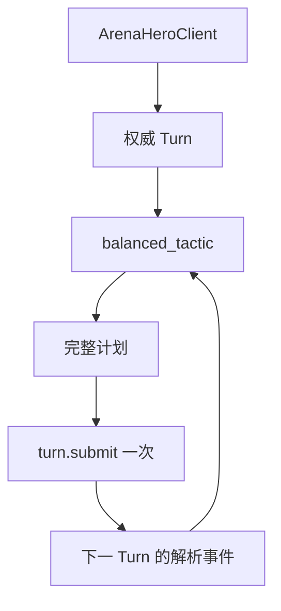
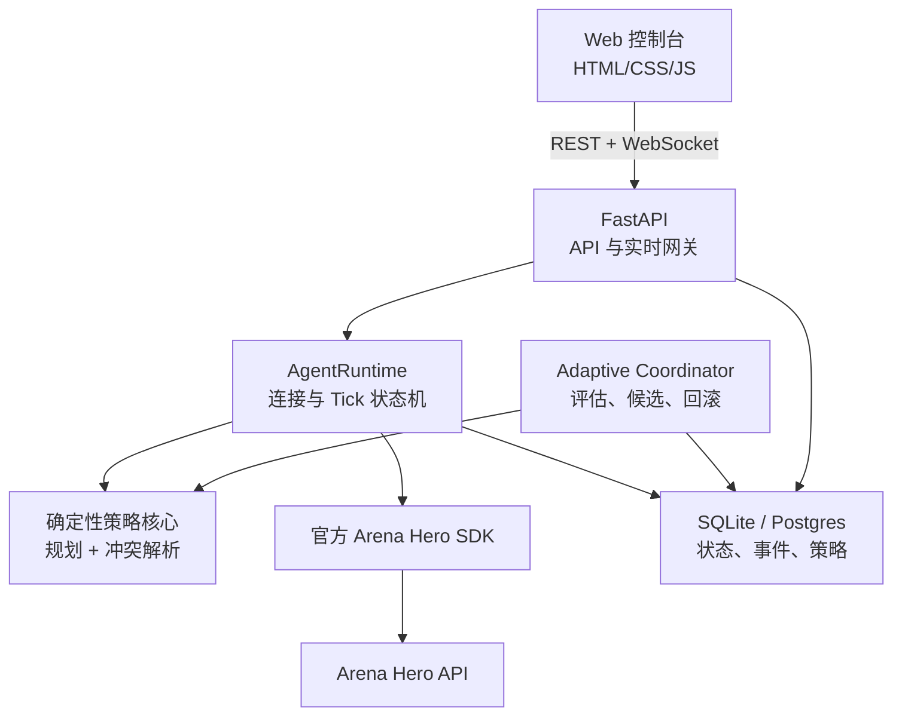
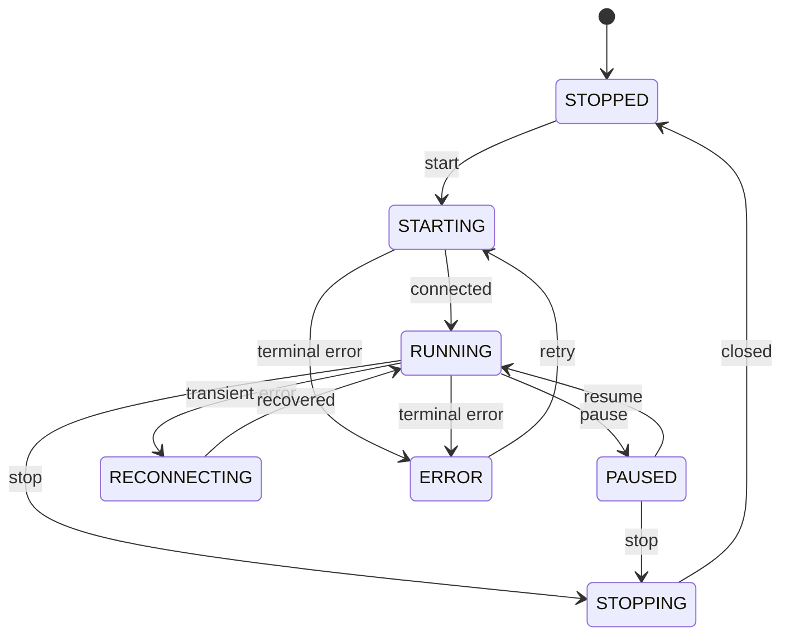
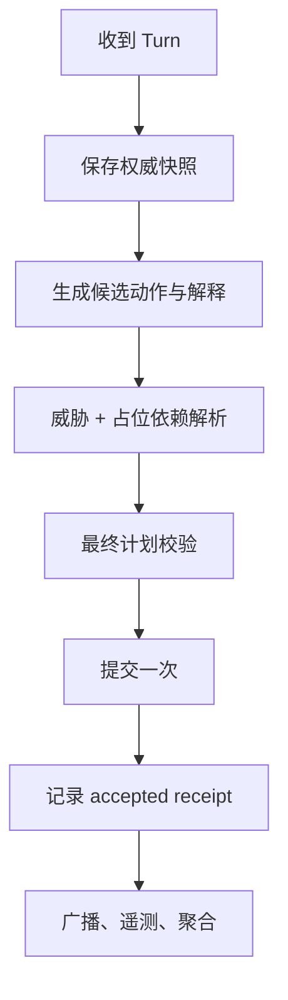

# Arena Hero Agent

面向 [Arena Hero](https://app.arenahero.io/arena) 的可解释、可测试、可持续运行的自动化战术 Agent。

当前 `v1.1.0` 已实现确定性 Python 战术、FastAPI 本地服务、SQLite 权威历史、实时 Web 控制台、全局移动解析、账户锁和 SQLite 固定窗口双 LLM 自适应。本文件同时保留原始整改背景与最终实现约束。

> 文档基线：仓库提交 [`f62b586`](https://github.com/Hurrvey/arena-hero-agent/commit/f62b586ea0addf89fa570134b22a11d44c684b58)，Arena Hero 规则包 `v0.14`，官方 Python SDK `0.2.9`。

## 目录

- [项目目标](#项目目标)
- [当前状态](#当前状态)
- [Arena Hero 核心规则](#arena-hero-核心规则)
- [策略设计](#策略设计)
- [当前实现](#当前实现)
- [已知问题与整改要求](#已知问题与整改要求)
- [目标系统架构](#目标系统架构)
- [后端设计](#后端设计)
- [前端设计](#前端设计)
- [API 契约](#api-契约)
- [实时事件协议](#实时事件协议)
- [数据模型与存储](#数据模型与存储)
- [自适应策略闭环](#自适应策略闭环)
- [安全设计](#安全设计)
- [项目结构](#项目结构)
- [安装与运行](#安装与运行)
- [测试与质量门禁](#测试与质量门禁)
- [部署与运维](#部署与运维)
- [开发路线图](#开发路线图)
- [验收标准](#验收标准)
- [常见问题](#常见问题)
- [许可证](#许可证)

## 项目目标

本项目希望构建一个长期在线的 Arena Hero 自动化 Agent，目标不是承诺固定排名，而是在完整遵守可见性和行动规则的前提下，同时优化三个独立的 lifetime 排行榜指标：

1. Champion Beacon 持有 Tick。
2. 对敌方单位和 Core 造成的伤害。
3. 参与摧毁敌方 Core。

工程目标包括：

- 在每个 Turn 的有限命令窗口内快速生成并提交一份完整合法计划。
- 优先保护 Core、Beacon carrier、载货 Worker 和存量资源。
- 以可见事实为依据，不把迷雾中的历史对象当作当前状态。
- 让策略决策可解释、可回放、可测试、可人工干预。
- 让前端只访问本项目后端，Arena Hero API key 永不进入浏览器。
- 让 LLM 只做受约束的离线评估与参数提议，不能直接控制单位或执行代码。

### 非目标

- 不绕过迷雾、读取隐藏对象或猜造对象 UUID。
- 不实现一套替代官方 SDK 的 WebSocket/重试/状态模型。
- 不让 LLM 直接提交行动、生成并执行 Python 或 Shell。
- 不把 `accepted=true` 解释为行动成功或排行榜成绩。
- 不提供“保证第一名”“永不死亡”一类无法验证的承诺。

## 当前状态

| 能力 | 状态 | 说明 |
| --- | --- | --- |
| 确定性战术循环 | 已实现 | 每个 Turn 基于当前状态构造计划，并且只调用一次 `turn.submit()`。 |
| Worker 经济与探索 | 已实现 | 资源 TTL、确定性一对一分配、环形探索、卡路与振荡恢复。 |
| Core 动态防御 | 已实现 | `CLEAR/WATCH/APPROACH/ATTACK/LETHAL` 五级威胁模型。 |
| Beacon runner/carrier | 已实现 | 有启动规模、距离、租约、停滞和冷却约束。 |
| 双 LLM 自适应调参 | 已实现，需加固 | evaluator/designer、规则指纹、候选校验和回滚已经存在。 |
| 自动化测试 | 已实现 | 运行 `python -m pytest -q` 获取当前精确数量；包含 10,000 Tick 长跑和真实浏览器测试。 |
| FastAPI 服务层 | 已实现 | loopback REST/WebSocket、状态机、安全头和脱敏错误 envelope。 |
| 实时 Web 控制台 | 已实现 | 总览、Canvas 地图、策略、自适应、历史和设置五个页面。 |
| 统一事件存储 | 已实现 | SQLite 保存 Turn、计划、事件、指标、revision、窗口和候选。 |
| 全局移动冲突解析 | 已实现 | 容量、离开依赖、交换/环、目标冲突和确定性降级均有测试。 |
| 多实例账户锁 | 已实现 | CLI/Web 使用相同账户哈希和跨进程锁。 |

### 已验证基线

```text
Python compileall     PASS
pytest                运行当前测试集获取精确数量
pip check             PASS
git diff --check      PASS
Secret scan           未发现真实凭据
Ruff                  62 个待整理项，主要是格式、导入和宽泛异常
Bandit                0 high / 1 medium / 2 low
```

这些结果说明当前 Demo 的策略核心已经具备较好的测试基础，但服务化、观测性和部分长期资源安全逻辑仍需完成。

## Arena Hero 核心规则

以下规则直接决定 Agent 和前端的设计。规则来源以仓库内置 [`skills/arena-hero`](skills/arena-hero) 为准。

### 世界、Tick 与状态

- 世界是持久、共享、无限的二维方格，没有赛季重置或单局最终胜者。
- 每个逻辑 Tick 有一个全局 15 秒命令窗口，但窗口在各玩家收到状态前已经开始。
- `state` 才是行动信号；`tick` 通知本身不能用于构造行动。
- 每个 `Turn` 是完整、权威的当前快照，不是对上一帧的增量补丁。
- 服务器不提供准确的命令窗口开始/截止时间，因此前端不得显示伪精确倒计时；可以显示“状态收到多久”以及本地运行状态。
- 每个受控对象每 Tick 只有一个行动槽，后设置的行动会替换之前的行动。
- Agent 应尽快提交一个完整计划，不能把旧 Turn 的计划重新用于新 Tick。

### 可见性与记忆

| 对象 | Manhattan 视野半径 |
| --- | ---: |
| Core | 5 |
| Worker | 3 |
| Vanguard | 4 |
| Ranger | 5 |

- 障碍使用整数 supercover 射线遮挡视野，也会阻挡 Ranger 射击。
- 当前视野是全部己方存活对象视野的并集。
- 己方 Core 和单位始终可见；敌方对象只在当前视野中出现。
- Beacon 坐标始终公开，但 `GROUND/CARRIED` 和 carrier 只在 Beacon 所在格可见时可信。
- 永久障碍可以长期记忆；资源、单位、Core 和 carrier 的历史状态只能作为有限期线索。
- 如果一个被记忆的资源格当前确实可见，但 `resource_cells` 中已不存在该资源，必须立即删除该记忆。

### Core、资源与人口容量

Core 资源容量为：

```text
resource_capacity = max(10, population × 5)
```

- `population` 只计算存活 Unit，不含 Core。
- 人口下降时，超过新容量的 Core 库存会在同 Tick 被立即销毁。
- Worker 存入时只存入可容纳部分，余量仍保留在 cargo。
- 不能依赖同 Tick 后续 `SPAWN` 修复因战斗死亡导致的容量溢出，因为战斗后的溢出销毁早于 Core 生产。
- Core 初始或重生后有 5 资源和一个免费 Worker。
- Core 被摧毁后通常在同 Tick 重生；如果没有合法出生格，后续 Turn 可能暂时没有 Core，此时不得虚构 Core 行动。

### 生产价格

必须使用官方 `unit_cost(unit_type, population)`，不要复制或硬编码公式。

| Unit | 基础价格 | 主要职责 |
| --- | ---: | --- |
| Worker | 5 | 探索、采集、运输、Beacon 机会任务 |
| Vanguard | 10 | 近战清场、Core 近圈守卫、carrier 护卫 |
| Ranger | 12 | 远程输出、carrier 狙击、Core 防御和进攻参与 |

- 第 1–20 个 Unit 使用基础价格。
- 第 21 个 Unit 开始提高 30%，之后每增加五个人口再次乘以 1.3，并按规则取整。
- 没有每 Tick upkeep。
- 生产在同 Tick 单位自毁与战斗死亡之后定价，当前 Turn 价格只是预览，实际事件结果才是最终事实。

### 行动解析顺序

对策略影响最大的顺序如下：

1. 锁定 Agent 与 Manual 最终计划。
2. Unit 自毁与第一次容量溢出处理。
3. Unit 移动和 Core 迁移。
4. Beacon 拾取/放下。
5. Worker 采集/存入。
6. 冻结战斗快照，结算所有合法攻击并同时应用伤害。
7. 处理 Core 资源缴获和人口下降后的容量溢出。
8. Unit 治疗。
9. Core 治疗、修盾或生产。
10. Core 重生和资源节点补充。

这意味着：

- 同 Tick 移动会改变攻击、采集和拾取时的位置。
- 致死伤害不能靠战后 `HEAL` 挽救。
- Worker 存入后如果友军在战斗中死亡，刚存入的资源可能因容量下降被销毁。
- 前端必须将“计划已接受”和“下一 Turn 返回的实际解析结果”分开展示。

### 移动与占位

- 单位只能向四个基数方向移动一格。
- 单格最多容纳两个占位实体，资源和 Beacon 不占实体槽位。
- 移入当前由友军占据的格子，只有在占位者同 Tick 确实成功离开时才可能成功。
- 多单位移动存在占位依赖、目标冲突和依赖失败，必须在提交前做全局意图解析，不能只让每个单位独立选最优方向。

### 战斗与恢复

- Vanguard 使用相邻方向 `SWEEP`。
- Ranger 可对水平、垂直或 45° 对角线 1–3 格内、无遮挡的目标或格子执行 `SHOOT`。
- Ranger 的格子射击在移动后解析；如果格子为空则 `SHOT_MISSED`。
- Core 伤害先消耗 shield，再消耗 HP。
- `HEAL` 在战斗后解析，每恢复 1 HP 消耗 Core 1 资源；Unit 必须存活且与静止己方 Core 同格。
- Unit heal 按 UUID 顺序先于 Core action 消耗资源，因此恢复预算必须确定性预留。

### Beacon

- Beacon 坐标始终公开。
- 只有当前确认 `GROUND` 且对象与 Beacon 同格时才执行拾取。
- carrier 需要优先避开可见致命格、返 Core 修复并接受护卫。
- Beacon 能提高 Core 的 shield 上限，但迷雾中的 carrier 状态不能被当作当前事实。

## 策略设计

### 总体优先级

每个 Turn 按以下顺序决策：

1. 保护即将致死的 Core、Beacon carrier 和高 cargo Worker。
2. 清除当前 Core 攻击者和一步后可形成攻击位的敌人。
3. 拾取同格地面 Beacon，维持 runner 推进和 carrier 生存。
4. 处理敌方 carrier、威胁己方 carrier 的目标和敌方 Core。
5. 执行 Worker 采集、存入、资源分配和探索。
6. 为必要恢复预留资源，再决定生产。
7. 解析全局移动冲突，验证最终计划并只提交一次。

### Core 动态防御

| 等级 | 当前可见判定 | 策略响应 |
| --- | --- | --- |
| `CLEAR` | 观察圈内无战斗敌军 | 只保留最小守军，其余单位执行经济、Beacon 和进攻任务。 |
| `WATCH` | 敌军进入观察圈，但下一步尚不能攻击 Core | 守军不远征，经济继续运行。 |
| `APPROACH` | 敌军移动一步后可形成合法攻击位 | 非 carrier 战斗单位回防，暂停 Worker 生产。 |
| `ATTACK` | 敌军当前可合法攻击 Core | 提升攻击者优先级，疏散近 Core 火线 Worker。 |
| `LETHAL` | 当前可见合法伤害足以摧毁 Core | 当前攻击者成为最高优先目标，不依赖战后恢复。 |

默认常备守军为 1 Vanguard + 2 Ranger：Vanguard 维持 Core 1–2 格防区，Ranger 维持 2–3 格防区。无威胁时不让全部战斗单位永久龟缩。

### Worker 经济

Worker 的动作优先级：

1. 受致命威胁时移动到更安全的合法格。
2. carrier 或高 cargo Worker 返回 Core。
3. 与 Core 同格且 cargo 大于 0 时存入，但先检查投影容量。
4. 当前格有资源时采集。
5. 前往确定性一对一分配的可见或未过期资源。
6. 沿八方向递增环探索，避免原地停滞和 A-B-A-B 振荡。

资源分配必须满足：

- 一个资源目标同 Tick 只分配给一个 Worker。
- 当前可见资源优先于历史线索。
- 历史资源默认 64 Tick 过期。
- 使用真实视野半径与 obstacle supercover 判断“当前可见但已不存在”，不能使用固定距离 1 的近似。
- `HARVEST_FAILED/RESOURCE_DEPLETED` 应立即清理目标并触发重新分配。

### 生存优先的路径评分

路径候选至少包含以下成本：

```text
step_score =
    goal_progress_reward
  - visible_attack_count × threat_weight
  - expected_visible_damage × damage_weight
  - occupancy_dependency_penalty
  - stagnation_penalty
  - oscillation_penalty
```

规则约束：

- Worker 不应为了接近资源进入当前已知 Ranger 合法射线。
- 所有单位禁止选择当前可见的确定致死格，除非这是避免更高优先级 Core 致死风险的必要牺牲。
- 被威胁的 Worker 优先选择 `visible_attack_count == 0` 的合法格。
- 不能因为目的地更接近目标，就忽略目的地的攻击风险。
- 风险只使用当前可见敌人和确定几何，不推断迷雾敌人。

### Beacon 任务

- 默认经济达到 6 Worker 后才允许远程 runner。
- 当前明确 `GROUND` 且距离较近时可机会性抢取。
- runner 必须持续缩短与 Beacon 的距离。
- 达到停滞阈值或出现 A-B-A-B 振荡时释放 runner，并对该任务启用冷却。
- carrier 的优先级高于普通经济目标；危险时返 Core、请求护卫或预排战后恢复。
- Beacon 状态不可见时，只保留坐标目标，不猜测 carrier 身份或归属。

### 分阶段生产

默认生产阶段：

```text
6 Worker
→ 1 Vanguard + 1 Ranger
→ 12 Worker
→ 3 Vanguard + 4 Ranger
→ 23 Worker
→ 约 2:1 的 Ranger/Vanguard 扩军
```

生产前必须同时检查：

- Core 当前静止。
- Core 格仍有实体容量。
- 必要的 HP/shield/carrier 恢复预算已经预留。
- 投影人口和动态价格允许生产。
- `APPROACH+` 时暂停 Worker，优先补足防守单位。
- 所有类型都超过资源容量时等待，不提交注定失败的动作。

### 投影容量与资源保全

对每个 Tick 计算保守的人口下界：

```text
projected_population =
    current_population
  - planned_self_destructs
  - visibly_doomed_units

projected_capacity = max(10, projected_population × 5)
```

如果 Worker 存入后 Core 资源会超过 `projected_capacity`，应保留超出部分 cargo，或优先撤回将要死亡的单位。自适应 score 必须对 `CORE_RESOURCE_OVERFLOW_DESTROYED` 加入明确负分，不能只记录而不参与评分。

### 全局移动意图解析

最终计划不能由各单位独立动作简单拼接。推荐两阶段规划：

1. 每个单位生成按风险和任务评分排序的候选动作。
2. 全局解析器按优先级选择动作，建立占位依赖图并消除冲突。

优先级建议：

```text
carrier 生存
> Core 致命防御
> 高 cargo Worker 生存
> 当前 Core 攻击者处理
> 资源存入/采集
> 普通任务推进
```

解析规则：

- 同一目标格超过容量时只保留最高优先级意图。
- 只有占位者拥有可执行的离开计划时，其他单位才可进入其当前格。
- 如果依赖链中任一动作失败或被取消，所有依赖它的移动回退到下一候选或 `WAIT`。
- 环形交换只有全部路径和容量同时合法时才允许。
- 解析后再次运行纯函数验证器，确保没有重复动作、越界规则或陈旧对象。

## 当前实现

| 文件 | 当前职责 |
| --- | --- |
| [`balanced_tactic.py`](balanced_tactic.py) | 连接 SDK、读取 Turn、构造完整计划、提交和主策略编排。 |
| [`defense_strategy.py`](defense_strategy.py) | Core 威胁分级、攻击几何、守军选择。 |
| [`economic_strategy.py`](economic_strategy.py) | 资源记忆、一对一分配、探索、路线进度和 runner 租约。 |
| [`strategy_policy.py`](strategy_policy.py) | 有范围约束的 `StrategyProfile` 和 scorecard。 |
| [`adaptive_strategy.py`](adaptive_strategy.py) | 遥测、规则指纹、LLM transport、评估/重设计、候选和回滚。 |
| [`skills/arena-hero`](skills/arena-hero) | 项目内置 Arena Hero v0.14 规则与 SDK 参考。 |
| `test_*.py` | 无真实 API key 的纯逻辑和集成行为测试。 |

### 当前 CLI 运行流



当前实现最大的工程特点是：计划生成与提交已经可运行，但状态、计划、回执和策略变更尚未通过稳定的服务接口提供给前端。

## 已知问题与整改要求

### P0：策略正确性

1. **Worker 可能进入当前已知 Ranger 火线。**
   `_move_to_goal()` 目前对“接近目标”的奖励高于目的地威胁，可能为了资源从 `(1,0)` 移动到 `(2,0)`，而可见敌方 Ranger 位于 `(2,3)`。整改：将目的地风险加入所有普通移动评分；禁止已知致死格，Worker 对任何可见攻击格施加高惩罚。

2. **单位可能移入不会离开的友军格。**
   `_candidate_steps()` 允许进入单个友军占据的目的地，但没有验证占位者是否确实成功离开。整改：实现两阶段移动意图和依赖图解析。

3. **资源记忆不会在完整视野矛盾时及时失效。**
   `refresh_economy_memory()` 使用距离 1 近似“确定可见”，忽略 Core/Unit 不同视野半径与障碍 LOS。整改：计算当前真实可见掩码；可见但缺失的资源立即删除。

4. **缺少人口下降后的容量投影。**
   Worker 可能在战斗前存入资源，随后友军死亡导致库存溢出销毁。整改：存入前计算保守人口下界和投影容量；score 加入 overflow 负分。

### P1：自适应与并发可靠性

1. `state.json` 未完整持久化 cycle cursor、candidate activation tick、profile revision 和评估窗口。
2. 重启后首轮可能读取从 Tick 0 开始的全部 telemetry，并与后续约 60 Tick 窗口直接比较，产生错误回滚。
3. `records_since()` 没有结束边界；采样期间写入的新记录可能跨周期重复计算。
4. JSONL 无限增长且每轮全文件扫描，不适合长期运行。
5. `ARENA_HERO_ADAPTIVE_AUTO_APPLY` 默认开启，风险高于当前验证成熟度。
6. 同一账户多个进程会竞争同一个 AGENT plan slot。
7. 前端保存策略与后台 LLM 切换 profile 时缺少 revision/CAS，可能丢失更新。

整改要求：

- 使用 `(start_tick, end_tick]` 的固定窗口。
- 持久化 cursor、activation tick、revision 和最后成功周期。
- score 按观测 Tick 数归一化，并记录样本数。
- 单机使用 SQLite 事务和进程锁；多实例使用 Postgres advisory lock 或 Redis lease。
- profile 更新使用乐观并发控制，冲突返回 `409`。
- 默认 `ARENA_HERO_ADAPTIVE_AUTO_APPLY=0`，先人工审阅候选。

### P1：服务化与观测性

- 当前入口使用 `game.turns()`，只能直接消费 Turn。服务化后应使用 `game.events()`，统一处理 `Tick`、`Turn` 和 `Received`，包括 MANUAL 计划回执。
- 自适应关闭时没有独立的持久历史。事件存储必须与 LLM 功能解耦。
- `accepted=true` 只输出到终端，没有对应解析结果、失败原因和行动级状态。
- 异常普遍采用宽泛 `except Exception` 并静默继续，不利于长期运行排障。
- `shutdown(wait=False)` 不能保证正在进行的 LLM HTTP 请求优雅结束。

### P2：工程质量

- `balanced_tactic.py` 超过 3,000 行，应按 planner、movement、beacon、combat、economy、production 拆分。
- 缺少 `pyproject.toml`、锁文件和 GitHub Actions。
- Ruff 有 62 个待处理项；Bandit 指出可配置 LLM URL 的 SSRF 风险。
- 需要结构化日志、指标、健康检查和数据保留策略。

## 目标系统架构



### 架构原则

- **浏览器不直连 Arena Hero。** 凭据、SDK 和提交行为全部在后端。
- **策略核心保持纯函数优先。** 输入 Turn 快照与记忆，输出计划和决策解释，便于测试。
- **运行态单一所有者。** 一个 Arena Hero 账户同一时间只能有一个活动 runtime。
- **状态与事件分离。** 当前快照用于快速展示，追加事件用于审计和回放。
- **提交路径不依赖 LLM。** 网络、LLM 或前端故障不能阻塞 Turn 计划。
- **先提交，再做后台工作。** 遥测、聚合、广播和 LLM 调用必须服从命令窗口时延。

## 后端设计

### AgentRuntime

`AgentRuntime` 是单个 Arena Hero 账户的唯一运行控制器，负责：

- 创建和关闭官方 SDK 客户端。
- 消费 `game.events()`。
- 保存最新 Turn、Tick、Received receipt 和解析结果。
- 调用确定性 planner。
- 在本 Tick 内只提交一次完整计划。
- 广播前端事件。
- 处理暂停、重连、终止和故障。
- 将原始运行事件写入独立存储。

### 运行状态机



状态语义：

| 状态 | 行为 |
| --- | --- |
| `STOPPED` | 无 SDK 连接，不提交行动。 |
| `STARTING` | 获取账户锁、初始化存储、建立连接。 |
| `RUNNING` | 消费事件、规划并提交。 |
| `PAUSED` | 保持可选观测连接，但不提交新 AGENT 计划。 |
| `RECONNECTING` | SDK 处理瞬时断线；前端显示最后状态已过期。 |
| `ERROR` | 认证、协议或策略不可恢复错误；必须显式重试。 |
| `STOPPING` | 停止接收任务，等待提交/写入安全结束并关闭连接。 |

### Tick 处理管线



硬性约束：

- planner 不执行网络 I/O。
- LLM 不在这条同步路径中。
- 如果某个子策略异常，记录结构化错误并回退到保守计划，不重复提交。
- 收到下一 Turn 后，用其中事件更新上一 Tick 的行动级结果。
- 不能把 `accepted` 当作 resolved success。

### RuntimeManager

`RuntimeManager` 负责多用户或多账户场景：

- `account_id -> AgentRuntime` 映射。
- 启动幂等：已经运行时再次 start 返回当前 runtime。
- 每账户单例锁。
- 服务关闭时按顺序停止全部 runtime。
- 单机部署使用文件锁或数据库锁；分布式部署使用 Postgres advisory lock/Redis lease。
- 锁必须带所有者、租期和心跳，进程崩溃后可以安全接管。

### 决策解释

planner 除了返回 SDK plan，还应返回不含密钥的解释对象：

```json
{
  "tick": 1234,
  "strategyRevision": 17,
  "threatLevel": "APPROACH",
  "summary": "召回 2 个战斗单位，暂停 Worker 生产",
  "actions": [
    {
      "entityId": "local-display-id",
      "entityType": "WORKER",
      "action": "MOVE_LEFT",
      "reasonCode": "AVOID_VISIBLE_FIRE",
      "reason": "目标格受到 1 次可见 Ranger 攻击，改走安全侧翼",
      "riskBefore": 1,
      "riskAfter": 0
    }
  ]
}
```

公开到前端的对象 ID 可以使用会话内短 ID；原始 UUID 只保存在受保护的本地事件数据中。

### 错误处理

结构化错误最少包含：

```json
{
  "component": "planner.movement",
  "tick": 1234,
  "errorType": "PlanValidationError",
  "recoverable": true,
  "retryCount": 0,
  "message": "movement dependency cycle rejected"
}
```

禁止记录 API key、Authorization header、完整 LLM 响应体或未脱敏 prompt。

## 前端设计

前端建议先使用原生 HTML/CSS/JS 完成，减少早期构建复杂度；地图使用 `<canvas>`，实时数据通过 WebSocket，控制和查询通过 REST。后续需要组件化时再迁移到 React/Vue，不改变 API 契约。

### 信息架构

| 页面 | 目标 | 核心内容 |
| --- | --- | --- |
| `/` 总览 | 一眼判断 Agent 是否安全运行 | 状态卡、地图、当前计划、单位概况、实时事件。 |
| `/strategy` 策略 | 调整可验证的参数 | 分组表单、范围校验、revision、差异预览、保存。 |
| `/adaptive` 自适应 | 审阅 LLM 建议 | 当前/候选 profile 对比、评估报告、样本窗口、应用/回滚。 |
| `/history` 历史 | 分析资源和战斗趋势 | Tick 时间线、Beacon、资源、伤害、Core 风险、overflow。 |
| `/settings` 设置 | 管理非敏感运行配置 | 端点显示、日志级别、保留期、UI 偏好；不显示 API key。 |

### 总览页布局

```text
顶部栏：项目名 | 连接状态 | Tick | 策略版本 | 启动/暂停/停止
第一行：资源/容量 | 人口 | Core HP/Shield | Beacon | 威胁等级
主体左侧：可缩放地图 Canvas
主体右侧：当前计划、决策原因、风险变化
底部左侧：单位表格与筛选
底部右侧：实时事件与解析结果
```

统计卡必须包含：

- 连接状态：运行、暂停、重连、错误、最后状态时间。
- Tick：当前权威 Turn Tick，不展示伪精确截止倒计时。
- 资源：`inventory / capacity`、空余、cargo 合计、投影容量。
- 人口：Worker/Vanguard/Ranger 数量和预计同 Tick 风险。
- Core：HP、shield、位置、移动状态、威胁等级。
- Beacon：坐标、当前可见状态、己方 carrier/未知、runner 任务进度。

### 地图 Canvas

图层从底到顶：

1. 网格和坐标。
2. 已知永久障碍。
3. 当前可见区域与迷雾遮罩。
4. 当前可见资源；历史资源使用虚线和过期透明度。
5. Core、Worker、Vanguard、Ranger。
6. 可见敌人和敌方 Core。
7. Beacon、runner 路径和 carrier 护卫圈。
8. 当前计划箭头、Ranger 射线、Vanguard sweep 区域。
9. 风险热区：只由当前可见敌人的合法攻击几何生成。

视觉规则：

- 当前事实使用实线和高不透明度，历史线索使用虚线和低不透明度。
- 敌人进入迷雾后立即从“当前敌人”图层删除，不能保留为实体；可在历史事件中查看。
- 资源被当前视野否定后立即移除。
- 颜色不能是唯一状态编码；同时使用图标、描边和文字标签，满足色觉可访问性。
- 点击对象后显示属性、当前任务、动作、原因和上一 Tick 解析结果。

### 当前计划面板

按优先级展示：

- 计划摘要和 `strategyRevision`。
- Core 威胁等级与依据。
- 每个对象的动作、理由、目标和风险变化。
- 计划提交状态：`DRAFT → ACCEPTED/REJECTED → RESOLVED`。
- 对应事件结果，例如 `MOVE_DESTINATION_OCCUPIED`、`SHOT_MISSED`、`CORE_SPAWN_SUCCEEDED`。

`ACCEPTED` 与 `RESOLVED` 必须使用不同颜色、图标和字段，避免误读。

### 单位表格

建议字段：

| 字段 | 说明 |
| --- | --- |
| ID | 会话内短 ID，不暴露完整 UUID。 |
| 类型 | Worker/Vanguard/Ranger/Core。 |
| 位置 | 当前权威坐标。 |
| HP/Shield | 当前值及上限。 |
| Cargo | Worker 私有 cargo。 |
| 任务 | 采集、返航、探索、runner、护卫、守军、进攻。 |
| 动作 | 当前 Tick 计划动作。 |
| 风险 | 当前格和目的地可见攻击数。 |
| 结果 | 上一 Tick 对应解析结果。 |

支持按类型、任务、风险、cargo、是否 carrier 筛选，并提供加载态、空状态、断线态和错误态。

### 策略编辑页

表单按以下分组：

- 经济：Worker 目标、经济启动规模、资源 TTL、停滞阈值。
- Beacon：机会半径、runner 租约、冷却、carrier 安全余量。
- 防御：常备 Vanguard/Ranger、观察圈、疏散半径。
- 战斗：Ranger/Vanguard 倾向、目标优先权重。
- 自适应：周期、最小样本、回滚比率、是否自动应用。

保存流程：

1. GET 当前 profile 和 `revision`。
2. 本地校验范围并展示差异。
3. PUT 新 profile 和 `expectedRevision`。
4. 后端在 Turn 边界原子切换。
5. revision 不一致时返回 `409`，前端展示服务器新版本并允许重新合并。

### 自适应页

必须展示：

- evaluator 报告摘要和明确的问题列表。
- 候选 profile 与当前 profile 的逐字段差异。
- 规则包 SHA-256 指纹。
- 评估窗口 `(startTick, endTick]`、观测 Tick 数和归一化 score。
- 候选状态：`PROPOSED/ACTIVE/REJECTED/ROLLED_BACK`。
- 手动“应用候选”“拒绝”“回滚”操作。

默认不自动应用候选。LLM 不可用时页面仍能显示 Agent、历史和手动策略。

### 前后端功能映射

| 前端功能 | REST/WS | 后端模块 |
| --- | --- | --- |
| 状态卡与控制按钮 | `/agent/status`、`/agent/start|pause|resume|stop` | `RuntimeManager` |
| 地图 | `/state/current` + `state.snapshot` | `AgentRuntime` / `StateStore` |
| 当前计划 | `/plan/current` + `plan.*` | Planner / EventStore |
| 单位与事件表 | `/events` + `resolution.results` | EventStore |
| 策略编辑 | `/strategy` | StrategyRepository |
| 自适应候选 | `/adaptive/*` + `adaptive.report` | AdaptiveCoordinator |
| 历史趋势 | `/metrics/series` | MetricsRepository |

## API 契约

所有接口使用前缀 `/api/v1`，JSON 字段采用 camelCase。错误统一返回：

```json
{
  "error": {
    "code": "STRATEGY_REVISION_CONFLICT",
    "message": "strategy was updated by another process",
    "requestId": "req_01...",
    "details": {"currentRevision": 18}
  }
}
```

### Agent 控制

| 方法 | 路径 | 作用 | 典型状态码 |
| --- | --- | --- | --- |
| GET | `/agent/status` | 获取 runtime、连接和最后 Turn 状态 | `200` |
| POST | `/agent/start` | 获取账户锁并启动 runtime | `202`, `409` |
| POST | `/agent/pause` | 暂停后续 AGENT 提交 | `202` |
| POST | `/agent/resume` | 恢复自动提交 | `202` |
| POST | `/agent/stop` | 优雅关闭 runtime | `202` |
| POST | `/agent/wait` | 当前 Turn 对全部未设置对象保持等待 | `202`, `409` |

`GET /api/v1/agent/status`：

```json
{
  "status": "RUNNING",
  "connected": true,
  "currentTick": 1234,
  "lastTurnReceivedAt": "2026-08-12T09:30:00Z",
  "stateAgeMs": 182,
  "strategyRevision": 17,
  "accountLockOwner": "runtime_01...",
  "lastError": null
}
```

API 不返回 key、完整 Authorization 信息或 LLM 凭据。

### 当前状态与计划

| 方法 | 路径 | 说明 |
| --- | --- | --- |
| GET | `/state/current` | 当前权威快照和派生风险，不返回迷雾实体。 |
| GET | `/plan/current` | 当前 Tick 的计划、解释、提交和解析状态。 |
| GET | `/events?afterSeq=&limit=` | 按服务事件序号增量读取历史。 |
| GET | `/metrics/summary` | 当前会话聚合指标。 |
| GET | `/metrics/series?fromTick=&toTick=&bucket=` | 历史序列。 |

`GET /api/v1/state/current` 的最小响应：

```json
{
  "tick": 1234,
  "receivedAt": "2026-08-12T09:30:00Z",
  "resources": {"inventory": 19, "capacity": 20, "space": 1, "projectedCapacity": 15},
  "population": {"total": 4, "workers": 2, "vanguards": 1, "rangers": 1},
  "core": {"position": [0, 0], "hp": 5, "shield": 4, "moving": false},
  "units": [],
  "visibleEnemies": [],
  "terrain": {"obstacles": [], "resources": []},
  "beacon": {"position": [0, 0], "visibility": "VISIBLE", "state": "GROUND"},
  "derived": {"coreThreatLevel": "CLEAR", "visibleRiskCells": []}
}
```

### 策略

| 方法 | 路径 | 说明 |
| --- | --- | --- |
| GET | `/strategy` | 获取当前 profile、schema、revision。 |
| PUT | `/strategy` | 使用 `expectedRevision` 更新，在 Turn 边界应用。 |
| GET | `/strategy/history` | 获取版本历史。 |
| POST | `/strategy/{revision}/rollback` | 创建一个恢复到旧配置的新 revision。 |

更新请求：

```json
{
  "expectedRevision": 17,
  "profile": {
    "workerTarget": 23,
    "economyBootstrapWorkers": 6,
    "resourceTtlTicks": 64,
    "standingVanguards": 1,
    "standingRangers": 2
  },
  "reason": "manual dashboard update"
}
```

后端不能原地改写旧 revision；每次保存都创建新版本并记录来源 `MANUAL/ADAPTIVE/ROLLBACK`。

### 自适应

| 方法 | 路径 | 说明 |
| --- | --- | --- |
| GET | `/adaptive/status` | 模式、周期、当前候选、最后成功/失败。 |
| GET | `/adaptive/reports` | 分页读取评估报告。 |
| GET | `/adaptive/candidates/{id}` | 查看候选、差异和验证结果。 |
| POST | `/adaptive/candidates/{id}/apply` | 使用 revision CAS 在 Turn 边界应用。 |
| POST | `/adaptive/candidates/{id}/reject` | 拒绝候选并记录理由。 |
| POST | `/adaptive/rollback` | 回滚当前 active candidate。 |

### 健康检查

| 方法 | 路径 | 语义 |
| --- | --- | --- |
| GET | `/health/live` | 进程存活，不检查外部 API。 |
| GET | `/health/ready` | 数据库可用、迁移完成；不要求 Agent 必须运行。 |

## 实时事件协议

WebSocket 路径：`/ws/v1/live`。

统一信封：

```json
{
  "schemaVersion": 1,
  "seq": 9001,
  "type": "state.snapshot",
  "at": "2026-08-12T09:30:00.182Z",
  "runtimeId": "runtime_01...",
  "tick": 1234,
  "payload": {}
}
```

事件类型：

| 类型 | 触发时机 |
| --- | --- |
| `runtime.status` | 启动、暂停、重连、错误、停止。 |
| `state.snapshot` | 收到新的权威 Turn。 |
| `plan.draft` | planner 生成并通过本地校验。 |
| `plan.accepted` | 服务端接收当前计划。 |
| `plan.rejected` | 提交被拒绝或失去窗口。 |
| `resolution.results` | 下一 Turn 返回上一 Tick 的行动解析结果。 |
| `strategy.updated` | 新 revision 在 Turn 边界生效。 |
| `adaptive.report` | 新评估或候选生成。 |
| `system.error` | 可展示的脱敏系统错误。 |

连接恢复：

- 客户端保存最后 `seq`。
- 断线后先调用 `/events?afterSeq=<seq>` 补齐，再恢复 WebSocket。
- 如果所需事件已超过保留期，后端返回 `EVENT_GAP`，前端重新读取 `/state/current` 和 `/plan/current`。
- WebSocket 是通知通道，REST 是恢复和权威查询通道。

## 数据模型与存储

### 本地开发

默认使用 SQLite WAL：

```text
data/arena_hero_agent.db
```

建议表：

| 表 | 关键字段 | 用途 |
| --- | --- | --- |
| `runtime_sessions` | id, account_key_hash, status, started_at, stopped_at | 运行会话和账户锁归属。 |
| `turn_snapshots` | session_id, tick, received_at, payload, schema_version | 权威状态快照。 |
| `plans` | session_id, tick, revision, status, payload, explanation | 当前计划和提交状态。 |
| `resolution_events` | session_id, tick, seq, type, payload | 行动级解析结果。 |
| `service_events` | seq, session_id, tick, type, payload, created_at | 前端补流和审计。 |
| `strategy_profiles` | revision, source, parent_revision, profile, created_at | 不可变策略版本。 |
| `adaptive_cycles` | id, start_tick, end_tick, sample_count, score, status | 有边界的评估窗口。 |
| `adaptive_candidates` | id, base_revision, profile, fingerprint, status | LLM 候选和回滚。 |

### 生产部署

- 单实例可继续使用 SQLite，但数据库文件必须位于持久卷。
- 多实例使用 Postgres，账户单例通过 advisory lock 实现。
- 不在网络文件系统上共享 SQLite 写入。
- 事件 payload 带 `schema_version`，迁移时保留向后兼容读取。

### 保留策略

默认建议：

- 当前状态与策略版本：长期保留。
- 原始 Turn 快照和精确坐标：7 天。
- 聚合指标：90 天或长期。
- 服务错误：30 天。
- LLM 脱敏 prompt/response：30 天，可配置关闭。
- 超期记录先聚合再删除，后台清理不能阻塞 Tick 提交。

## 自适应策略闭环

### 角色边界

1. **Evaluator** 读取规则包指纹、固定 Tick 窗口的聚合遥测和当前 profile，输出缺陷与改进方向。
2. **Designer** 读取相同规则包、当前 profile 和 evaluator 结论，只输出受 schema 限制的 JSON 参数。
3. **Validator** 在本地验证字段、范围、规则指纹、经济/Beacon 下限和 revision。
4. **Coordinator** 创建候选；默认等待人工应用。
5. **Canary** 在有边界且可比较的后续窗口评估候选，达到回滚阈值时创建回滚 revision。

LLM 永远不能：

- 获取 Arena Hero API key。
- 调用 SDK 或提交计划。
- 执行生成的 Python/Shell。
- 读取迷雾信息。
- 绕过本地 schema、范围和 revision 校验。

### 窗口与游标

每次 cycle 使用不可变边界：

```text
records where start_tick < tick <= end_tick
```

并持久化：

- `last_successful_end_tick`
- `candidate_activation_tick`
- `base_strategy_revision`
- `candidate_strategy_revision`
- `sample_count`
- `score_per_observed_tick`

读取与推进 cursor 必须在同一事务中完成。远程 LLM 调用失败时不应静默丢弃窗口：记录 `FAILED_RETRYABLE`，按有限次数重试或明确跳过。

### Scorecard

内部 score 只用于比较策略版本，不是官方排行榜。建议按观测 Tick 归一化：

```text
score =
    beacon_reward
  + deposited_resources_reward
  + harvested_resources_reward
  + damage_reward
  + core_participation_reward
  + carrier_survival_reward
  - core_damage_penalty
  - unit_loss_penalty
  - idle_worker_penalty
  - route_stall_penalty
  - resource_overflow_penalty
  - lethal_exposure_penalty
```

至少同时报告原始总数、观测 Tick 数和 `score/tick`。不同对手、资源密度和威胁窗口并不天然可比，因此低样本量不能触发自动应用或自动回滚。

### 原始遥测与 LLM 脱敏数据

当前 raw telemetry 可能包含精确 ID、用户名、坐标、可见敌人与计划，这不等于“已脱敏”。目标实现应分为：

- **Raw store**：本地受保护，用于回放和调试，按账户隔离并受保留期限制。
- **LLM projection**：只含聚合计数、分桶指标、reason code 和规则指纹；移除姓名、UUID、精确坐标、路线和凭据。

## 安全设计

### 凭据

- Arena Hero API key 仅从后端环境变量、受限 `.env` 或密钥管理器读取。
- 浏览器、WebSocket payload、日志、事件库和 LLM prompt 都不得包含 key。
- LLM key 与 Arena Hero key 完全分离。
- `.env` 保持 Git ignored，生产环境优先使用平台 secret。

### LLM Base URL 与 SSRF

`ARENA_HERO_LLM_BASE_URL` 不能直接接受任意前端输入。后端必须：

- 只允许 `https`；本地开发显式开启时才允许 localhost HTTP。
- 拒绝 loopback、private、link-local、multicast 和云 metadata 地址。
- DNS 解析后再次检查目标 IP，防止 DNS rebinding。
- 限制重定向，重定向目标重新校验。
- 推荐配置供应商 allowlist，而不是任意 URL。
- 设置连接、读取和总超时以及响应体大小上限。

### Web 服务

- 只监听 localhost 时可以用于个人本地控制。
- 暴露到局域网/公网时必须启用 HTTPS、身份验证、严格 CORS 和 CSRF 防护。
- start/stop、策略应用和回滚属于高权限操作，需要审计。
- 错误响应不能泄露路径、环境变量、上游响应体或堆栈。
- 日志使用字段化输出并对 token、Authorization、用户名和 UUID 做脱敏。

### 账户与并发

- 同一 Arena Hero 账户只能有一个活动 runtime。
- Manual 操作可能覆盖同 Tick 对应对象的 Agent 计划；前端必须显示 `Received.source`。
- profile 更新使用 revision CAS。
- 服务关闭时先停止接收变更，再等待当前提交、数据库事务和后台任务安全结束。

## 项目结构

建议逐步迁移为：

```text
arena-hero-agent/
├── app/
│   ├── main.py
│   ├── api/
│   │   ├── agent.py
│   │   ├── state.py
│   │   ├── strategy.py
│   │   ├── adaptive.py
│   │   └── websocket.py
│   ├── runtime/
│   │   ├── agent_runtime.py
│   │   ├── runtime_manager.py
│   │   └── account_lock.py
│   ├── strategy/
│   │   ├── planner.py
│   │   ├── models.py
│   │   ├── movement.py
│   │   ├── visibility.py
│   │   ├── economy.py
│   │   ├── beacon.py
│   │   ├── defense.py
│   │   ├── combat.py
│   │   └── production.py
│   ├── adaptive/
│   │   ├── coordinator.py
│   │   ├── scoring.py
│   │   ├── redaction.py
│   │   └── transport.py
│   ├── storage/
│   │   ├── database.py
│   │   ├── state_store.py
│   │   ├── event_store.py
│   │   └── strategy_store.py
│   └── observability/
│       ├── logging.py
│       └── metrics.py
├── frontend/
│   ├── index.html
│   ├── strategy.html
│   ├── adaptive.html
│   ├── history.html
│   ├── css/
│   └── js/
├── skills/arena-hero/
├── tests/
│   ├── unit/
│   ├── integration/
│   ├── contract/
│   └── fixtures/
├── data/
├── .env.example
├── pyproject.toml
├── uv.lock
├── README.md
└── LICENSE
```

迁移期间保留现有模块的兼容导入，先移动纯函数，再移动运行入口，避免一次性重写策略。

## 安装与运行

### 推荐安装与 Web 运行

要求：

- Python 3.11+
- Arena Hero 账号和 API key
- 可访问默认 API `https://api.arenahero.io`

```bash
git clone https://github.com/Hurrvey/arena-hero-agent.git
cd arena-hero-agent
python -m venv .venv
```

PowerShell：

```powershell
uv sync --python 3.11 --group dev
Copy-Item .env.example .env
notepad .env
.\.venv\Scripts\python.exe -m uvicorn app.main:app --host 127.0.0.1 --port 8000
```

macOS/Linux：

```bash
uv sync --python 3.11 --group dev
cp .env.example .env
${EDITOR:-vi} .env
.venv/bin/python -m uvicorn app.main:app --host 127.0.0.1 --port 8000
```

最小配置：

```dotenv
ARENA_HERO_API_KEY=
ARENA_HERO_ADAPTIVE=0
ARENA_HERO_ADAPTIVE_AUTO_APPLY=0
```

建议将 `.env.example` 中自适应与自动应用默认值也改为 `0`。只有完成凭据配置、窗口持久化和候选审阅后再启用：

```dotenv
ARENA_HERO_ADAPTIVE=1
ARENA_HERO_LLM_API_KEY=
ARENA_HERO_LLM_BASE_URL=https://api.openai.com/v1
ARENA_HERO_EVALUATOR_MODEL=
ARENA_HERO_DESIGNER_MODEL=
ARENA_HERO_ADAPTIVE_INTERVAL_TICKS=60
ARENA_HERO_ADAPTIVE_MIN_SECONDS=900
ARENA_HERO_ADAPTIVE_AUTO_APPLY=0
ARENA_HERO_ADAPTIVE_ROLLBACK_RATIO=0.15
ARENA_HERO_ADAPTIVE_STATE_DIR=adaptive
```

终端输出：

```text
tick=123 accepted=True
```

`accepted=True` 只代表服务接受计划。行动是否移动、命中、采集、生产或失败，需要读取下一 Turn 的事件。

访问 `http://127.0.0.1:8000`。服务无 key 也能启动并展示本地 UI；点击启动 Agent 时才读取 `.env`。CLI 兼容入口仍是：

```bash
\.venv\Scripts\python.exe .\balanced_tactic.py
```

CLI 与 Web 共享账户锁，不得同时控制同一 Arena Hero 账号。暂停继续保存快照但不提交计划；恢复后不补交旧 Tick。`accepted` 仅表示服务接收，下一 Turn 的事件才表示 resolved 结果。

## 测试与质量门禁

### 当前测试与发布门禁

```bash
.\.venv\Scripts\python.exe -m playwright install chromium
.\.venv\Scripts\python.exe -m pytest -q
.\.venv\Scripts\ruff.exe check app tests
.\.venv\Scripts\bandit.exe -q -r app
.\.venv\Scripts\python.exe -m pip check
git diff --check
```

测试不得连接真实 Arena Hero 账户，也不得要求真实 API key。

### 必须新增的回归测试

1. Worker 不进入当前可见 Ranger 水平、垂直或对角合法射线。
2. Worker 在无安全格时选择风险更低而不是单纯更接近目标的格。
3. 友军占位者 `WAIT` 时，其他单位不能移动进其格。
4. 占位者离开失败时，依赖移动全部回退。
5. Core/Worker/Vanguard/Ranger 各自视野半径与 obstacle supercover 的资源记忆失效。
6. 存入后可见单位死亡导致投影容量下降时，避免资源溢出。
7. `Scorecard.internal_score()` 对 `overflow_destroyed` 有明确负权重。
8. 自适应重启后从持久 cursor 恢复，不读取 Tick 0 全历史。
9. `(start, end]` 窗口不会重复或漏算边界记录。
10. 两个 runtime 无法同时获取同一账户锁。
11. profile revision 冲突返回 `409` 且不覆盖新版本。
12. `accepted`、`rejected`、`resolved` 在 API 和 WebSocket 中保持不同状态。

### 推荐 `pyproject.toml` 工具链

```text
pytest
pytest-asyncio
httpx
ruff
bandit
pip-audit
coverage
```

CI 门禁：

```bash
python -m compileall -q app tests
ruff format --check .
ruff check .
bandit -q -r app
python -m pytest --cov=app --cov-report=term-missing
python -m pip check
```

### GitHub Actions

Pull Request 至少执行：

- Python 3.11 和 3.12 单元/集成测试。
- Ruff format/check。
- Bandit 和依赖漏洞扫描。
- Secret scan。
- 前端静态检查和 API schema contract test。
- README 相对链接和 Mermaid/JSON 示例检查。

CI 会对 Git 历史执行 Gitleaks，并只接受 `v主版本.次版本.补丁版本` 形状的发布 tag。GitHub 仓库还应在 Settings 中把该 tag 规则设为受保护；工作流不在日志打印 secret。

## 部署与运维

### 推荐拓扑

个人使用：

```text
浏览器 → localhost FastAPI → AgentRuntime → Arena Hero
                         └→ SQLite 持久卷
```

多用户服务：

```text
HTTPS 反向代理 → FastAPI 实例 → Postgres
                         └→ 每账户 runtime/worker + 分布式锁
```

### 配置

建议环境变量：

| 变量 | 默认 | 说明 |
| --- | --- | --- |
| `ARENA_HERO_API_KEY` | 无 | 必填，只在后端读取。 |
| `ARENA_HERO_BASE_URL` | 官方生产地址 | 仅后端配置。 |
| `AGENT_DATABASE_URL` | `sqlite:///data/arena_hero_agent.db` | 状态和事件存储。 |
| `AGENT_LOG_LEVEL` | `INFO` | 结构化日志级别。 |
| `AGENT_RAW_RETENTION_DAYS` | `7` | 原始 Turn 保留期。 |
| `AGENT_CORS_ORIGINS` | localhost | 明确 allowlist。 |
| `AGENT_DECISION_BUDGET_MS` | `2000` | 本地 planner 软预算，不是服务器截止时间。 |
| `ARENA_HERO_ADAPTIVE` | `0` | 自适应总开关。 |
| `ARENA_HERO_ADAPTIVE_AUTO_APPLY` | `0` | 默认人工审阅。 |

### 可观测性

至少记录以下指标：

- Turn 收到到提交的本地延迟。
- 提交 accepted/rejected/missed 数量。
- planner 异常、保守回退和无动作数量。
- 各 action 的 resolved success/failure reason。
- Core HP/shield、威胁等级、死亡、重生。
- 采集、存入、cargo、资源溢出销毁。
- Worker idle、停滞、振荡、危险目的地被拒次数。
- Beacon 持有、runner 推进和 carrier 损失。
- 自适应窗口、样本数、归一化 score、候选、应用和回滚。

### 告警

建议告警条件：

- 连续多个 Turn 未收到权威状态。
- 连续提交被拒或协议错误。
- 同账户锁丢失。
- Core 进入 `LETHAL`。
- 资源 overflow 大于 0。
- planner 超过软预算。
- 数据库写入失败或磁盘空间不足。
- 自适应连续失败，但不影响主战术运行。

### 优雅关闭

1. runtime 状态切到 `STOPPING`。
2. 拒绝新的 start/profile apply。
3. 等待当前提交和数据库事务结束。
4. 取消未开始的 LLM 周期；正在进行的请求按总超时结束。
5. 关闭 SDK 连接。
6. 释放账户锁。
7. 状态切到 `STOPPED`。

## 开发路线图

### M0：正确性修复

- [x] 目的地威胁进入路径评分，新增 Worker 火线回归测试。
- [x] 实现移动意图、占位依赖和冲突解析器。
- [x] 使用真实视野掩码清理资源记忆。
- [x] 增加人口/容量投影和 overflow score 惩罚。
- [x] 自适应与自动应用默认关闭。

完成标准：四类 P0 场景全部有失败复现和通过的回归测试。

### M1：策略核心拆分

- [x] 建立 `app/strategy` 纯模型和 planner 接口。
- [x] 拆分 movement/visibility/economy/beacon/defense/combat/production。
- [x] 保持现有 CLI 入口兼容。
- [x] 引入 `pyproject.toml`、锁文件、Ruff、Bandit 和 CI。

完成标准：现有测试全部通过，CLI 行为保持兼容，策略模块不依赖 FastAPI。

### M2：FastAPI Runtime

- [x] 实现 RuntimeManager、AgentRuntime 和状态机。
- [x] 切换到 `game.events()`，记录 Tick/Turn/Received。
- [x] 实现 SQLite store、迁移和账户锁。
- [x] 完成 agent/state/plan/events/health API。
- [x] 实现 WebSocket 信封、seq 和断线补流。

完成标准：模拟 SDK 流下可启动、暂停、恢复、停止；一个 Turn 只提交一次；前端可重连恢复。

### M3：Web 控制台

- [x] 完成统计卡、地图 Canvas、当前计划和实时事件。
- [x] 完成单位筛选、详情、加载/空/错误/重连状态。
- [x] 完成策略编辑、revision 冲突处理和差异预览。
- [x] 完成历史指标页面。

完成标准：用户不看终端也能判断连接、计划、风险和上一 Tick 结果。

### M4：自适应加固

- [x] SQLite 固定窗口与 cursor 事务（Postgres 保留到 M5）。
- [x] score/tick、overflow 惩罚和最低样本量。
- [x] Raw/LLM projection 分离与保留策略。
- [x] Base URL allowlist 和 SSRF 防护。
- [x] 候选人工审阅、CAS 应用和可审计回滚。

完成标准：重启不重复窗口；LLM 故障不影响提交；未经验证的候选不会自动生效。

### M5：生产化

- [ ] 身份验证、HTTPS、严格 CORS。
- [ ] Postgres 和分布式账户锁。
- [ ] 指标、告警、备份和恢复演练。
- [ ] 负载、长稳和故障注入测试。
- [ ] 发布版本、迁移文档和运维 Runbook。

## 验收标准

### 策略

- 相同 Turn、记忆和 profile 产生相同计划。
- 不使用当前不可见敌人、Core、资源或 carrier 作为事实。
- Worker 不进入可避免的当前可见攻击格。
- 所有进入友军占位格的移动都有可验证离开依赖。
- 资源记忆在当前真实视野矛盾时立即失效。
- 存入决策考虑已知人口下降与投影容量。
- 每 Turn 最多一次完整提交，旧 Turn 永不重提。

### 后端

- start/pause/resume/stop 幂等且状态明确。
- 同一账户只能存在一个运行 runtime。
- `accepted` 与 `resolved` 分离存储和展示。
- 策略更新具有不可变 revision 和冲突保护。
- WebSocket 断线可以通过 seq + REST 补流恢复。
- LLM、数据库清理和前端广播不阻塞同步提交路径。

### 前端

- 首屏显示连接、Tick、资源容量、人口、Core、Beacon 和威胁。
- 地图区分当前事实、历史线索和迷雾。
- 可查看每个动作的理由和上一 Tick 解析结果。
- 所有页面有加载、空、错误、暂停和重连状态。
- 不在 HTML、JS、LocalStorage、Network payload 中出现 Arena Hero API key。
- 键盘可操作，颜色不是唯一状态提示，移动端可查看核心状态。

### 自适应

- 每个窗口边界固定、可审计、不重复。
- 分数按观测 Tick 归一化并包含 overflow 惩罚。
- LLM 只接收脱敏聚合数据。
- 候选通过 schema、范围、指纹和 revision 校验。
- 默认人工应用；自动模式需要足够样本和明确开启。
- 失败时保留旧策略并继续主战术。

## 常见问题

### `ModuleNotFoundError: No module named 'arena_hero'`

确保安装和运行使用同一个 Python：

```bash
python -m pip install -r requirements.txt
python -c "import arena_hero; print(arena_hero.__version__)"
```

### 认证失败

- 确认使用的是 Arena Hero 账号对应的 API key。
- 清理当前终端中可能残留的旧环境变量，再重新启动。
- 不要把 key 粘贴到聊天、Issue、PR、截图或日志。

PowerShell：

```powershell
Remove-Item Env:ARENA_HERO_API_KEY -ErrorAction SilentlyContinue
python .\balanced_tactic.py
```

### 为什么 `accepted=True` 但单位没有成功移动？

`accepted` 只表示计划通过命令接口接收。移动仍可能因占位、依赖、障碍、对象死亡或其他解析规则失败。查看下一 Turn 的 resolution event。

### 为什么前端不显示 15 秒倒计时？

命令窗口是全局窗口，服务器在逐个发布状态前已经开始计时，并且不公开准确开始/截止时间。显示精确倒计时会误导用户；前端只显示本地状态年龄、提交时刻和提交结果。

### Manual 操作和 Agent 冲突怎么办？

Manual 计划可能覆盖同 Tick 对应对象的 Agent 行动。服务使用 `game.events()` 读取 `Received.source`，前端明确标注最终来源。完全自动运行时避免对相同对象做 Manual 操作。

### 为什么默认关闭自适应自动应用？

当前对比窗口仍会受到对手、资源密度和威胁差异影响。先人工审阅候选和窗口证据，更符合资源保全目标；完成固定窗口、归一化评分和最低样本量后再选择自动应用。

### 规则或 SDK 不兼容怎么办？

先检查官方 SDK 版本并更新到与仓库规则包兼容的发布版本。不要放宽模型校验、修改 site-packages 或自行重写协议解析。

## 贡献规范

- 修改规则相关行为时，同时更新对应测试和本 README。
- 新策略参数必须有类型、范围、默认值、UI 文案和迁移方式。
- 新事件必须有 schema version、保留策略和前端降级行为。
- 提交前运行测试、Ruff、Bandit、`pip check` 和 `git diff --check`。
- 不提交 `.env`、API key、原始生产 telemetry、数据库或运行日志。
- Pull Request 说明需要包含：问题复现、规则依据、方案、风险、测试结果和回滚方式。

## 项目链接

- 仓库：[Hurrvey/arena-hero-agent](https://github.com/Hurrvey/arena-hero-agent)
- Arena：[app.arenahero.io/arena](https://app.arenahero.io/arena)
- 内置规则包：[`skills/arena-hero`](skills/arena-hero)

## 许可证

本项目按 [GNU General Public License v3](LICENSE) 发布。
