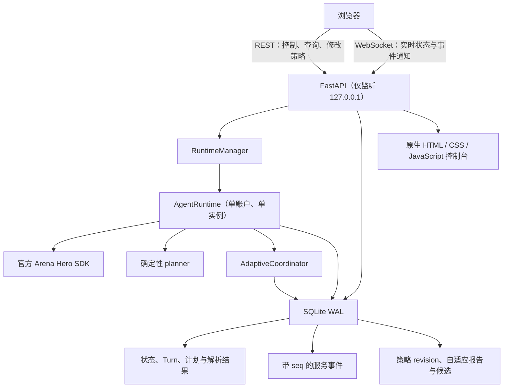
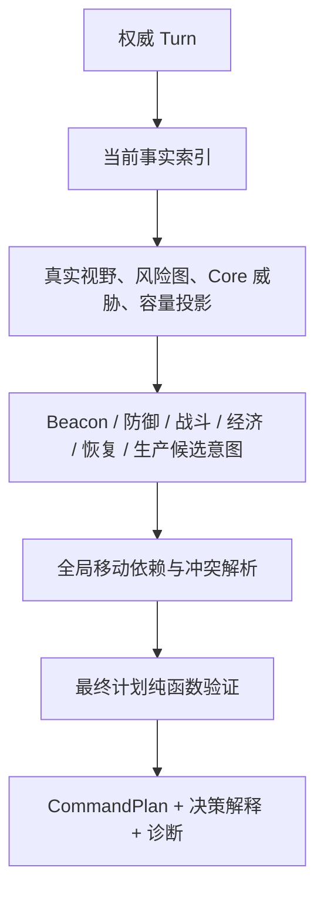
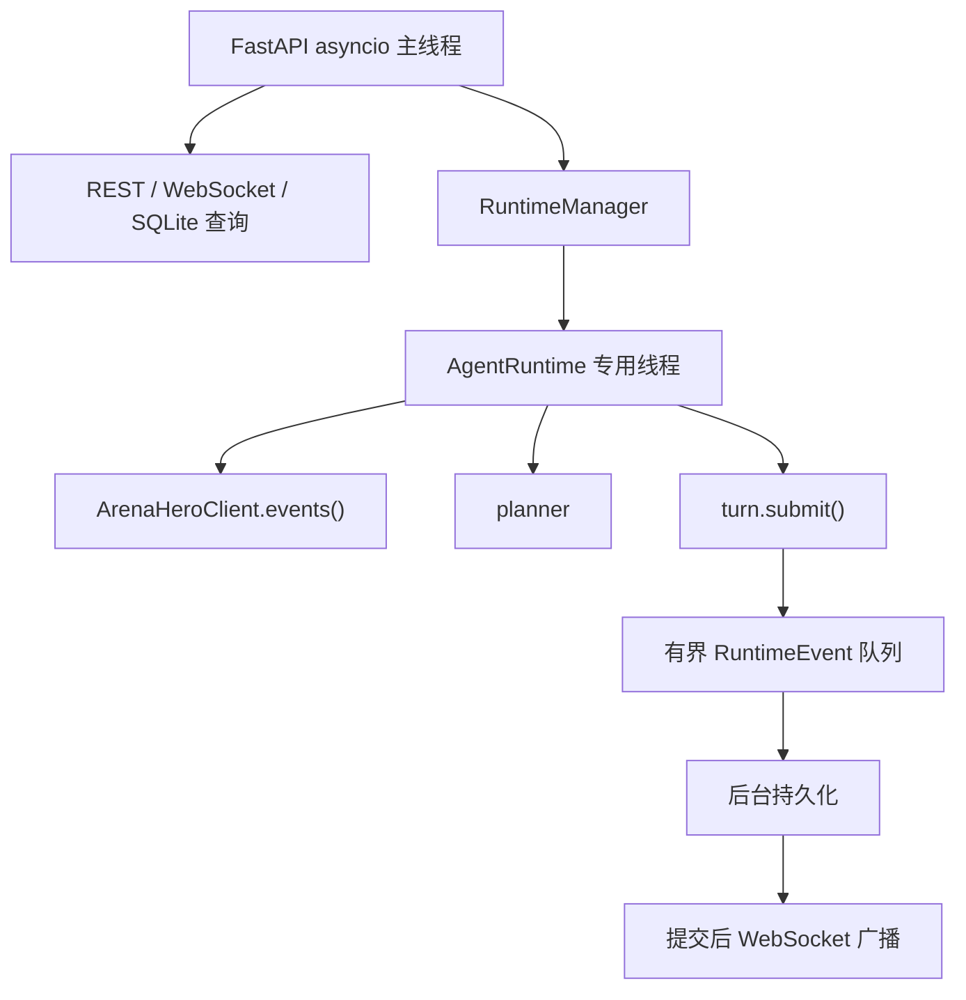

# Arena Hero 本地完整 MVP 设计

> 状态：五个设计章节已经逐段确认并完成自审，等待用户对本地完整规格做最终书面复核。

**目标：** 在保留现有确定性 Arena Hero 战术与 CLI 兼容性的前提下，完成 M0–M3：策略正确性修复、可测试的策略边界、单账户 FastAPI Runtime、SQLite 运行态存储以及实时 Web 控制台。

**范围：** 本轮交付面向 `127.0.0.1` 的本地单用户、单 Arena Hero 账户部署。第五章只完成服务化所必需的 SQLite 固定窗口、revision/CAS、脱敏投影、旧数据迁移和默认人工应用，不扩展为公网或分布式 M4–M5。公网认证、Postgres、Redis、反向代理、分布式账户锁和多租户部署不属于本轮范围。

## 1. 系统边界与总体架构

现有确定性战术仍然是唯一行动权威。FastAPI、Web 控制台、SQLite 和自适应模块只能管理、观察和调整受约束的策略参数，不能绕过 planner 直接控制游戏对象。



### 1.1 兼容入口

- 保留仓库根目录的 `balanced_tactic.py` 和现有 CLI 启动方式：`python .\balanced_tactic.py`。
- 新增 Web 服务入口：`python -m uvicorn app.main:app --host 127.0.0.1 --port 8000`。
- Web 控制台通过 `http://127.0.0.1:8000` 访问。
- CLI 与 Web Runtime 复用同一个 planner adapter，不维护两套策略实现。

### 1.2 Runtime 所有权

- `AgentRuntime` 在独立工作线程消费官方 SDK 的 `game.events()`，统一处理 `Tick`、`Turn` 和 `Received`。
- 每个权威 Turn 最多生成并提交一份完整 AGENT 计划。
- 暂停时保留观察连接与状态记录，但不提交新的 AGENT 计划；恢复后从下一个权威 Turn 继续。
- 同一 Arena Hero 账户只能获得一个本地 runtime 锁。第二个进程或服务实例启动时返回 `409`，防止两个客户端相互覆盖 AGENT 计划。

### 1.3 数据与安全边界

- 浏览器不直接连接 Arena Hero API。
- 浏览器不得接收 Arena Hero API key、LLM key、Authorization header、完整对象 UUID 或未脱敏 LLM prompt。
- 前端对象使用会话内稳定短 ID；受保护的本地数据库可以保留回放所需的原始 UUID，但不得通过公开 API 返回。
- SQLite 是 REST 权威查询与 WebSocket 断线补流的共同事实来源。
- WebSocket 只负责实时通知；断线后客户端使用 `afterSeq` 从 REST 补流，必要时重新获取当前状态和计划。
- evaluator/designer 每次评估继续加载仓库内置的 `skills/arena-hero` 规则包及其 SHA-256 指纹。

### 1.4 渐进迁移

- 不一次性重写现有大型策略文件。
- 优先抽出可独立测试的 movement、visibility、capacity projection 和 planner adapter。
- 根目录旧模块保留兼容导入，已有测试和 CLI 在迁移过程中持续可运行。
- FastAPI、存储或前端故障不得阻塞 Turn 的确定性计划提交。
- LLM 永远不进入同步提交路径，也不能直接生成或提交 Arena Hero 动作。

### 1.5 明确排除

本轮不实现以下能力：

- 公网账号系统、HTTPS 终止和远程多用户访问；
- Postgres、Redis、分布式账户锁或跨主机高可用；
- 让浏览器保存或编辑任何密钥；
- 让 LLM 直接控制单位、执行 Python/Shell 或读取迷雾信息；
- 以另一套自制网络客户端替代官方 Arena Hero SDK。

## 2. M0 策略修复与 Planner 数据流

M0 不改变“经济 + Beacon + 动态防御”的总体战略，而是修复危险移动、友军占位依赖、错误资源记忆和人口下降后的资源溢出。现有 `choose_actions()` 保留兼容入口，内部逐步迁移到“先形成意图，再统一解析，最后一次写入计划”的数据流。



### 2.1 Planner 结果边界

新 planner adapter 返回统一结果：

```python
@dataclass(frozen=True)
class PlannerResult:
    tick: int
    plan: CommandPlan
    explanation: DecisionExplanation
    diagnostics: PlannerDiagnostics
```

- `plan` 是唯一可提交的完整 AGENT 计划。
- `explanation` 描述每个对象的动作、reason code、目标和风险变化，供 Web 控制台展示。
- `diagnostics` 记录资源分配、投影容量、被拒危险格、移动依赖和保守回退。
- CLI 和 Web Runtime 调用同一个 adapter，不维护两套策略。
- 相同 Turn、记忆和 `StrategyProfile` 必须产生完全相同的计划、解释和诊断。

### 2.2 当前可见风险图

新增不推断迷雾敌人的纯函数：

```python
build_visible_risk_map(
    friendly_objects,
    visible_enemies,
    obstacle_cells,
) -> VisibleRiskMap
```

每个风险格至少包含：

```python
@dataclass(frozen=True)
class CellRisk:
    visible_attack_count: int
    expected_damage: int
    attackers: tuple[bytes, ...]
```

计算规则：

- Vanguard 只威胁四个相邻格。
- Ranger 威胁水平、垂直和精确 45 度对角线距离 1–3 的格子，射线遇到障碍立即停止。
- 风险只使用当前 Turn 的可见敌人与确定几何。
- Core 致死判断同时考虑 shield 和 HP；Unit 致死判断使用当前 HP。
- 风险代表“当前可见攻击机会”，不声称敌人必然选择攻击。

所有普通移动都必须经过风险图。候选采用确定性字典序，不再让“更接近目标”的奖励压过当前可见危险：

1. 是否为确定致死格；
2. 可见攻击次数；
3. 预期可见伤害；
4. 是否产生不可验证的占位依赖；
5. 是否形成停滞或 A-B-A-B 振荡；
6. 与任务目标的距离变化；
7. 固定方向顺序。

Worker 在存在零风险合法格时不得进入有可见攻击风险的格；没有零风险格时选择攻击数和预期伤害最低的格。普通资源任务不得进入确定致死格。只有为避免更高优先级的 Core 致死风险而执行明确牺牲时才允许进入，并记录 `CORE_DEFENSE_SACRIFICE`。高 cargo Worker 和 Beacon carrier 的生存优先于普通任务推进。

### 2.3 全局移动意图解析

尚未使用行动槽的对象先生成有序候选，不立即调用 SDK `move()`：

```python
@dataclass(frozen=True)
class MoveCandidate:
    destination: Position
    direction: Direction
    risk: CellRisk
    goal_distance: int
    reason_code: str


@dataclass(frozen=True)
class MoveIntent:
    entity_id: bytes
    origin: Position
    priority: int
    candidates: tuple[MoveCandidate, ...]
```

解析优先级为：

```text
Beacon carrier 生存
> Core 致命防御
> 高 cargo Worker 生存
> 当前 Core 攻击者处理
> Worker 存入和当前资源采集
> Beacon runner 推进
> 普通经济、护卫、探索和进攻
```

解析器必须满足：

- 先排除障碍、非法方向、坐标越界和当前可见敌方占位格。
- 多个己方对象争同一空位时保留最高任务优先级；同优先级按原始 UUID 决定。
- 进入友军当前占据格时，必须建立“占位者成功离开”依赖。
- 占位者无移动、候选被取消、目的地冲突或依赖链失败时，所有依赖移动回退到下一候选。
- 只有整个闭环都满足最终所有权和容量时才接受合法移动环。
- 无安全合法候选时执行 `WAIT`，不提交已知会失败的移动。
- 解析完成后再统一调用 SDK 控制器写入动作。

纯函数输出为：

```python
@dataclass(frozen=True)
class MovementResolution:
    accepted: Mapping[bytes, MoveCandidate]
    rejected: tuple[RejectedMove, ...]
    dependency_edges: tuple[MovementDependency, ...]
```

### 2.4 真实视野与资源记忆

用 Arena Hero 的实际对象视野和整数 supercover 遮挡替代“与友军距离不超过 1”的近似：

```python
compute_visible_cells(
    friendly_objects,
    known_obstacles,
) -> frozenset[Position]
```

视野半径严格为 Core 5、Worker 3、Vanguard 4、Ranger 5。障碍格本身可见，障碍后方不可见；角点经过时两侧格都参与遮挡；多个己方对象的视野取并集。

资源记忆规则：

- 当前 `turn.resource_cells` 出现的格立即写入或刷新 `last_seen_tick`。
- 历史资源格如果处于当前真实视野、但不在 `turn.resource_cells` 中，立即删除。
- 不在当前视野中的历史格仅是短期线索，默认最多保留 64 Tick。
- `HARVEST_FAILED/RESOURCE_DEPLETED` 立即清除对应目标。
- 成功采集自然节点后清除节点；下一 Turn 同格仍有资源时，以新权威状态为准。
- 前端以虚线、低透明度显示历史线索，与当前资源明确区分。

该设计不会同步全图迷雾资源，也不会把历史资源当作当前事实。

### 2.5 投影人口、容量与存入保护

新增投影对象：

```python
@dataclass(frozen=True)
class CapacityProjection:
    current_population: int
    projected_population_floor: int
    current_capacity: int
    projected_capacity: int
    projected_overflow: int
    visibly_doomed_unit_ids: tuple[bytes, ...]
```

人口下界只扣除本 Tick 明确计划自毁的 Unit，以及根据当前可见攻击、确定最终位置预计会受到足够合法伤害的 Unit。安全移动到非致死目的地的 Unit 不计入预计死亡；隐藏敌人不作为事实。

```text
projected_capacity = max(10, projected_population_floor × 5)
```

Worker 存入前计算当前库存、可容纳金额、同 Tick 已确定存入以及投影容量。由于 `DEPOSIT` 没有金额字段，如果存入会在战斗后产生可预见 overflow：

- 有安全移动格时保留 cargo 并离开 Core 格；
- 无需释放生产槽时可在 Core 附近等待下一 Turn；
- Worker 自身预计死亡时，对比预计 overflow 损失与 cargo 掉落风险，选择较小损失并记录 reason code；
- 不假设同 Tick 后续 `SPAWN` 能挽救战斗阶段已经发生的容量溢出。

Scorecard 增加明确的 `overflow_destroyed × resource_overflow_penalty` 负分，并记录 `overflow_destroyed`、`projected_overflow_avoided`、`cargo_preserved` 和 `deposit_deferred_for_capacity`。

### 2.6 防御兼容约束

- 保留 `CLEAR/WATCH/APPROACH/ATTACK/LETHAL` 五级防御模型。
- Vanguard 守军保持 Core 曼哈顿距离 1–2，Ranger 守军保持 2–3。
- `WATCH` 时守军不得因远方 carrier、敌 Core 或普通任务离开防区。
- `APPROACH/ATTACK/LETHAL` 时，非 carrier 战斗单位回防优先于远征。
- Core 在本 Tick 完成第四阶段迁移时，以合法投影目的地评估防御；迁移确定失败时仍使用当前格。
- Core 致死后即使同 Tick 重生并更换 UUID，上一代 Core 的实际伤害仍计入遥测。

### 2.7 最终验证与故障回退

提交前运行无副作用验证器，检查 Tick、对象归属、每对象单动作、移动方向、障碍、友军离开依赖、容量冲突、当前可见性边界和 Core 状态约束。计划不得包含密钥、LLM 内容或前端专用字段。

普通候选验证失败时只把对应对象降级为 `WAIT`。planner 子模块整体异常时保留已确认的同格 Beacon 生存动作和必要 Core 防御，其余回退到 `WAIT`，记录结构化 `planner.fallback`，并且仍只提交一次，不在同 Tick 生成第二份计划。

### 2.8 M0 验收测试

至少覆盖：

1. Worker 不进入可避免的 Ranger 水平、垂直或对角射线。
2. 无完全安全格时选择风险较低而非距离目标更近的格。
3. 友军占位者 `WAIT` 时不能移入其格。
4. 占位者离开计划冲突时依赖移动回退。
5. 合法移动环通过，不完整环全部回退。
6. 四类己方对象的资源视野半径正确。
7. obstacle supercover 后方不被误判为当前可见。
8. 当前可见但已消失的资源记忆立即清除。
9. 预计人口下降时避免可预见库存 overflow。
10. 安全移动后的 Unit 不被错误计入预计死亡。
11. overflow 事件明确降低自适应得分。
12. 相同输入得到相同计划和解释。
13. 守军在 `WATCH` 下不离开规定防区。
14. 完成迁移的 Core 使用正确位置评估威胁。
15. 最终验证失败时只提交一次保守计划。

## 3. FastAPI Runtime、SQLite 与实时协议

Arena Hero 的 15 秒全局命令窗口拥有最高优先级。数据库写入、前端广播、历史聚合和 LLM 都不得挡在 `turn.submit()` 前面。

### 3.1 进程与线程模型

FastAPI 运行于主 asyncio 事件循环；官方同步 SDK 在单个专用后台线程中运行：



- SDK 线程只处理接收、规划和提交的关键路径。
- 大快照序列化、SQLite、指标与 WebSocket 广播由提交后的消费者处理。
- Runtime 线程不引用 FastAPI 对象，也不直接向浏览器写数据，只产生不可变 `RuntimeEvent`。
- 本地单账户 MVP 只创建一个 SDK 工作线程。

### 3.2 Runtime 状态机

```python
class RuntimeStatus(StrEnum):
    STOPPED = "STOPPED"
    STARTING = "STARTING"
    RUNNING = "RUNNING"
    PAUSED = "PAUSED"
    RECONNECTING = "RECONNECTING"
    ERROR = "ERROR"
    STOPPING = "STOPPING"
```

```text
STOPPED --start--> STARTING --首个连接/状态--> RUNNING
RUNNING --pause--> PAUSED --resume--> RUNNING
RUNNING --瞬时断线--> RECONNECTING --恢复--> RUNNING
STARTING/RUNNING/RECONNECTING --不可恢复错误--> ERROR
RUNNING/PAUSED/ERROR --stop--> STOPPING --资源释放--> STOPPED
ERROR --retry--> STARTING
```

- `start` 幂等；活动状态下返回现有 runtime，不创建第二个线程。
- `pause` 保持观察连接和状态记录，但不调用 planner 或提交新 AGENT 计划。
- `resume` 只从之后收到的新权威 Turn 恢复，不重提暂停期间的旧 Turn。
- `stop` 等待当前提交结束，关闭 SDK，刷新事件队列并释放账户锁。
- `retry` 只允许从 `ERROR/STOPPED` 启动。
- 服务退出使用同一优雅关闭流程。
- `ERROR` 只保存脱敏错误类型和恢复建议。

### 3.3 单账户锁

本地 MVP 使用进程内与跨进程两层保护：

1. `RuntimeManager` 映射防止同一 FastAPI 进程创建两个 Runtime。
2. 根据 Arena Hero API key 的不可逆哈希派生锁名，在 `data/locks/` 持有 Windows 兼容的独占文件锁。

锁文件只包含哈希标识、runtime ID、PID 和启动时间，不保存 key。获取失败时 `/agent/start` 返回 `409 AGENT_ACCOUNT_LOCKED`。锁的正确性依赖操作系统持有的独占句柄，而不是单独的 PID 文件；正常 stop、启动失败和进程崩溃都必须允许安全释放或接管。CLI 入口也使用相同锁，禁止 CLI 与 Web Runtime 同时控制同一账户。

### 3.4 Turn 处理顺序

Runtime 使用 `game.events()` 处理 `Tick`、`Turn` 和 `Received`。`handle_turn()` 的严格顺序为：

1. 在内存记录收到时间和 Tick，不做阻塞式数据库写入。
2. 将当前 `turn.events` 归属于上一 Tick 的计划并生成 `resolution.results`。
3. 更新 `TacticMemory` 和当前 profile 快照。
4. 暂停状态只产生 `state.snapshot`，不提交。
5. 调用 planner adapter 得到 `PlannerResult`。
6. 运行最终验证。
7. 立即且只调用一次 `turn.submit()`。
8. 在内存中标记 `ACCEPTED` 或 `REJECTED`。
9. 将状态、计划、解释、回执、解析结果和诊断投递到有界后台队列。
10. AdaptiveCoordinator 仅在提交之后接收脱敏观测。

每个 `(runtime_id, tick)` 有唯一提交标记；重复 Turn 或重连不得二次提交。队列满时保留最新状态和高优先级错误，允许丢弃可重建的低优先级指标，不能阻塞 submit。`accepted` 只表示命令被接收，下一 Turn 的 resolution event 才决定解析结果。

### 3.5 依赖注入

Runtime 通过协议注入官方客户端工厂：

```python
class GameClientFactory(Protocol):
    def create(self, api_key: str) -> GameClient: ...


class GameClient(Protocol):
    def events(self) -> Iterator[Tick | Turn | Received]: ...
    def close(self) -> None: ...
```

生产工厂创建 `ArenaHeroClient`；测试工厂推送 Turn、Agent/Manual receipt、瞬时断线、认证/协议错误、重复 Tick 和阻塞关闭。Planner、Clock、ID 生成器、账户锁和 Store 同样通过构造函数注入，测试不得连接真实 Arena Hero。

### 3.6 SQLite 模式

本地 MVP 使用标准库 `sqlite3` 和显式 migration，不引入 SQLAlchemy/Alembic。默认数据库为 `data/arena_hero_agent.db`，初始化执行：

```sql
PRAGMA journal_mode = WAL;
PRAGMA foreign_keys = ON;
PRAGMA busy_timeout = 5000;
PRAGMA synchronous = NORMAL;
```

核心表：

| 表 | 主要字段与用途 |
| --- | --- |
| `schema_migrations` | migration version 和 applied_at。 |
| `runtime_sessions` | runtime ID、账户哈希、状态、起止时间、最后 Tick、脱敏错误。 |
| `turn_snapshots` | `(session_id, tick)`、收到时间、raw/public JSON、schema version。 |
| `plans` | `(session_id, tick)`、strategy revision、状态、计划、公开计划、解释、receipt。 |
| `resolution_events` | plan Tick、observed Tick、事件类型、短 ID、公开 payload。 |
| `service_events` | 全局单调 `seq`、session、tick、type、payload、created_at。 |
| `strategy_profiles` | 不可变 revision、source、parent、profile、reason、激活 Tick、status。 |
| `adaptive_cycles` | 固定窗口、样本数、归一化 score、fingerprint 和状态。 |
| `adaptive_candidates` | base revision、candidate profile、校验和候选状态。 |

`turn_snapshots.raw_payload_json` 只供受保护的本地回放并受保留期限制；REST 默认只读去除完整 UUID、用户名和敏感字段的 public payload。

计划状态为 `DRAFT/ACCEPTED/REJECTED/PARTIALLY_RESOLVED/RESOLVED`。缺失独立成功事件的 WAIT 或动态动作不能被伪造为成功，归并规则必须保留“无独立解析事件”的事实。

策略版本不可原地更新。保存创建 `PENDING` revision，在下一个 Turn 边界切换为 `ACTIVE`，原版本成为 `SUPERSEDED`。自适应候选默认 `PROPOSED`，不自动应用。

### 3.7 Repository 与事务

业务层依赖窄接口：

```python
class RuntimeStore(Protocol):
    def create_session(...) -> RuntimeSession: ...
    def update_status(...) -> None: ...
    def save_turn_batch(...) -> tuple[ServiceEvent, ...]: ...
    def current_state(...) -> PublicState | None: ...
    def current_plan(...) -> PublicPlan | None: ...
    def events_after(seq: int, limit: int) -> EventPage: ...


class StrategyRepository(Protocol):
    def current() -> StrategyRevision: ...
    def create(expected_revision: int, ...) -> StrategyRevision: ...
    def activate_pending(tick: int) -> StrategyRevision | None: ...
    def rollback(expected_revision: int, target_revision: int, ...) -> StrategyRevision: ...
```

每个 Turn 的 snapshot、plan、resolution 和相应 `service_events` 在同一 SQLite 事务中提交。事务成功后才广播 WebSocket，保证浏览器收到 `seq` 时 REST 已可读取同一记录。

### 3.8 REST API

所有接口使用 `/api/v1` 和 camelCase JSON。

Runtime 控制：

```text
GET  /api/v1/agent/status
POST /api/v1/agent/start
POST /api/v1/agent/pause
POST /api/v1/agent/resume
POST /api/v1/agent/stop
POST /api/v1/agent/retry
```

`start` 不接收 API key，只读取后端本地 `.env`。

查询：

```text
GET /api/v1/state/current
GET /api/v1/plan/current
GET /api/v1/events?afterSeq=0&limit=200
GET /api/v1/metrics/summary
GET /api/v1/metrics/series?fromTick=&toTick=&bucket=
```

事件 `limit` 默认 200、最大 1000。状态只含当前权威可见实体和明确标记的历史资源线索；所有对象 ID 使用 session 内短 ID。无 Turn 时返回 `404 STATE_NOT_AVAILABLE`。

策略：

```text
GET  /api/v1/strategy
PUT  /api/v1/strategy
GET  /api/v1/strategy/history
POST /api/v1/strategy/{revision}/rollback
```

PUT 使用 `expectedRevision` 和完整 profile 替换；后端复用 `StrategyProfile` 范围校验。冲突返回 `409 STRATEGY_REVISION_CONFLICT`，新 revision 只在 Turn 边界生效。浏览器不能修改 LLM URL 或 secret。

自适应：

```text
GET  /api/v1/adaptive/status
GET  /api/v1/adaptive/reports
GET  /api/v1/adaptive/candidates/{id}
POST /api/v1/adaptive/candidates/{id}/apply
POST /api/v1/adaptive/candidates/{id}/reject
POST /api/v1/adaptive/rollback
```

本轮默认 `ARENA_HERO_ADAPTIVE_AUTO_APPLY=0`；应用候选必须带 `expectedRevision`。

健康检查：

```text
GET /api/v1/health/live
GET /api/v1/health/ready
```

live 只检查进程；ready 检查数据库、migration 和 RuntimeManager，不要求 Agent 已启动。

### 3.9 错误模型

```json
{
  "error": {
    "code": "AGENT_ACCOUNT_LOCKED",
    "message": "another local process controls this Arena Hero account",
    "requestId": "req_01...",
    "details": {}
  }
}
```

每个请求有 request ID；4xx 提供可执行修复提示；5xx 不返回堆栈、路径、上游响应体、环境变量或凭据。认证失败只说明 Arena Hero 凭据无效或失效。数据库关键写入最终失败时 Runtime 进入 `ERROR`，不得假装历史已经保存。前端静态资源缺失不阻塞 Runtime，但 ready 会报告控制台资源不完整。

### 3.10 WebSocket 协议

路径为 `/ws/v1/live`，统一信封：

```json
{
  "schemaVersion": 1,
  "seq": 9001,
  "type": "state.snapshot",
  "at": "2026-08-13T01:30:00.182Z",
  "runtimeId": "rt_01...",
  "tick": 1234,
  "payload": {}
}
```

事件类型包括 `runtime.status`、`state.snapshot`、`plan.draft`、`plan.accepted`、`plan.rejected`、`resolution.results`、`strategy.updated`、`adaptive.report` 和 `system.error`。

- 仅广播已经提交到 SQLite 的 `service_events`。
- 新连接先收到当前最大 seq 的 `hello`。
- 客户端保存最后 seq，重连后先请求 `/events?afterSeq=<lastSeq>`。
- 超过保留窗口返回 `409 EVENT_GAP`，客户端重新获取当前状态、计划和指标。
- 每个 WebSocket 客户端有有界发送队列；慢客户端被断开，绝不反向阻塞 Runtime。
- 控制命令只经 REST 发送，WebSocket 不接收高权限操作。

### 3.11 Runtime 验收测试

至少覆盖：

1. start/pause/resume/stop/retry 状态转换与幂等性。
2. 每 Turn 最多一次提交，重复 Turn 不二次提交。
3. pause 继续记录状态但不提交，resume 不重提旧 Turn。
4. Agent 与 Manual receipt 均被记录并区分来源。
5. 认证失败进入 `ERROR` 且不泄露 key。
6. CLI 与 Web Runtime 无法同时获取同一账户锁。
7. 崩溃释放文件锁后可重新接管。
8. SQLite migration 可重复运行。
9. Turn batch 与 service events 原子提交。
10. `accepted` 与下一 Turn 的 `resolved` 分离。
11. profile CAS 冲突不覆盖新 revision。
12. pending profile 只在 Turn 边界激活。
13. WebSocket seq 单调且 REST 补流无重复、无缺口。
14. 慢 WebSocket 客户端不阻塞 Runtime。
15. 公开 payload 不含 key、完整 UUID、用户名或 LLM prompt。
16. 无当前状态时返回明确 404。
17. health ready 不要求 Agent 正在运行。
18. 服务停止等待当前提交、关闭 SDK、刷新持久化队列并释放锁。

## 4. Web 控制台与战术地图

UI 以 `arena-hero-ui-assets/reference/dashboard-ui-concept.png` 为视觉基线，采用深色战术指挥台、蓝色己方、红色威胁、金色 Beacon、地图主视角和高信息密度。界面直接使用 `arena-hero-ui-assets/` 中的原创 GPL-3.0 素材，不重新生成或以 Emoji、占位图替代。

### 4.1 视觉体系

| 语义 | 色值 |
| --- | --- |
| 全局背景 | `#07111F` |
| 深层背景 | `#040A13` |
| 面板 | `#0D1B2C` |
| 抬升面板 | `#102238` |
| 友军与主操作 | `#2D9CFF` |
| 路径与辅助信息 | `#36D5FF` |
| 正常与成功 | `#35D17C` |
| Beacon | `#FFC844` |
| 警告 | `#FFB83E` |
| 敌军与危险 | `#FF4D5F` |
| 障碍 | `#6C7885` |
| 正文 | `#F2F7FC` |
| 次要文字 | `#9BB0C6` |

字体只使用本地系统栈：

```css
--font-ui: Inter, "Noto Sans SC", "Microsoft YaHei", system-ui, sans-serif;
--font-data: "JetBrains Mono", "SFMono-Regular", Consolas, monospace;
```

战术地图是唯一重点视觉元素。发光只用于运行状态、Beacon、选中对象和致命威胁；普通面板使用细边框、弱阴影和低对比背景。不展示没有真实数据的趋势线，不制作伪精确 15 秒倒计时。参考图不作为页面背景，所有内容由真实 HTML、CSS 和 Canvas 构建。

### 4.2 前端结构

前端使用原生 HTML、CSS 和 JavaScript ES Modules，不引入 React/Vue，也不要求 Node 构建才能运行：

```text
frontend/
├── index.html
├── css/
│   ├── tokens.css
│   ├── base.css
│   ├── layout.css
│   ├── components.css
│   ├── map.css
│   └── responsive.css
├── js/
│   ├── app.js
│   ├── router.js
│   ├── api-client.js
│   ├── live-connection.js
│   ├── app-store.js
│   ├── formatters.js
│   ├── components/
│   │   ├── runtime-header.js
│   │   ├── metric-card.js
│   │   ├── status-badge.js
│   │   ├── plan-status.js
│   │   ├── event-list.js
│   │   ├── unit-table.js
│   │   ├── entity-detail.js
│   │   ├── profile-diff.js
│   │   └── empty-state.js
│   ├── map/
│   │   ├── tactical-map.js
│   │   ├── map-camera.js
│   │   ├── map-assets.js
│   │   ├── map-layers.js
│   │   ├── map-hit-test.js
│   │   └── map-accessibility.js
│   └── views/
│       ├── overview.js
│       ├── strategy.js
│       ├── adaptive.js
│       ├── history.js
│       └── settings.js
└── tests/
    ├── app-store.test.mjs
    ├── live-connection.test.mjs
    ├── profile-diff.test.mjs
    └── map-camera.test.mjs
```

FastAPI 将 `/assets/arena-hero/*` 映射到素材包，将 `/assets/app/*` 映射到前端文件；`/`、`/strategy`、`/adaptive`、`/history` 和 `/settings` 都返回同一应用外壳，由轻量 History API router 切换视图。

`frontend/tests/*.test.mjs` 是由 Python Playwright 页面夹具在真实浏览器上下文加载的 ES module 测试，不要求用户安装 Node 包管理器，也不引入 bundler 或生产构建步骤。

### 4.3 素材使用

- DOM 图标优先使用 `icons/ui-symbols.svg` 的 SVG symbols，以 `currentColor` 表达友军、敌军、Beacon 和状态。
- Canvas 预加载 `png/` 下的 Core、Worker、Vanguard、Ranger、Beacon、资源和障碍透明 PNG。
- 正式 UI 不复制未经管理的素材副本，直接由 FastAPI 静态挂载。
- `reference/dashboard-ui-concept.png` 只用于视觉回归，不进入生产界面。
- 素材加载失败时使用 Canvas 几何降级图形并记录脱敏 `system.error`，不能让地图空白。

### 4.4 应用外壳与控制

桌面顶栏包含品牌、主导航、运行状态、Tick、策略版本和控制按钮。按钮随状态变化：

| Runtime 状态 | 可用操作 |
| --- | --- |
| `STOPPED` | 启动 |
| `STARTING` | 禁止重复操作 |
| `RUNNING` | 暂停、停止 |
| `PAUSED` | 恢复、停止 |
| `RECONNECTING` | 停止 |
| `ERROR` | 重试、停止 |
| `STOPPING` | 全部禁用 |

停止操作需要确认，明确说明只停止后续 Agent 计划，不删除数据库或策略。暂停无需危险确认，但立即说明“仍在观察，不再提交计划”。控制按钮在 REST 完成或收到 `runtime.status` 前保持 pending，不乐观伪造状态。

### 4.5 总览布局与响应式

宽屏布局：

```text
┌────资源────┬────人口────┬────Core────┬──Beacon──┬────威胁────┐
├────────────────────────────┬───────────────────────────────┤
│                            │ 当前计划                      │
│       实时战术地图          ├───────────────────────────────┤
│                            │ 实时事件                      │
├────────────────────────────┴───────────────────────────────┤
│                     单位状态表                              │
└────────────────────────────────────────────────────────────┘
```

- `≥1440px`：地图约 60%，计划与事件约 40%。
- `1100–1439px`：双列保持，统计卡允许换行。
- `768–1099px`：地图独占一行，计划和事件下置双列。
- `<768px`：单列，统计卡横向滚动，表格改成对象卡片。

首屏始终显示 Runtime、Tick、状态年龄、资源/容量、投影容量、cargo、人口组成、Core HP/shield/迁移、Beacon、威胁和计划阶段。

### 4.6 状态卡语义

- 资源卡显示库存/容量、投影容量、cargo 和预计 overflow；风险使用图标、边框和文字共同表示。
- 人口卡显示 Worker/Vanguard/Ranger 组成和预计同 Tick 风险。
- Core 卡显示 HP、shield、当前权威位置和迁移进度；投影目的地必须明确标成“投影”。
- Beacon 卡只显示当前权威 `GROUND/CARRIED/UNKNOWN`，UNKNOWN 不猜 carrier；另列 runner 和距离。
- 威胁卡显示五级状态及当前可见攻击机会数，`LETHAL` 可短促强调但遵守 reduced motion。

### 4.7 战术地图

Canvas 使用 `devicePixelRatio`，以相对视口坐标绘制 int64 世界坐标。默认以 Core 为中心；无 Core 时使用己方集合中心或 Beacon。支持鼠标/触摸平移缩放、回到 Core、适配己方单位，并限制缩放范围。新 Turn 不强制重置用户相机。

图层从底到顶：

1. 背景、坐标与网格；
2. 已知永久障碍；
3. 当前可见区域和迷雾；
4. 当前资源；
5. 未过期历史资源线索；
6. 当前己方 Core 与 Unit；
7. 当前可见敌方对象；
8. Beacon；
9. runner、carrier、守军和资源任务标记；
10. 当前计划移动路线；
11. Ranger 射线与 Vanguard sweep；
12. 当前可见风险热区；
13. 选中对象、目标和移动依赖；
14. 标签与短 ID。

当前事实使用实线与高不透明度；历史资源使用虚线、低透明度和“历史”标记。当前视野否定的资源立即删除；敌人进入迷雾后从地图移除，不保留半透明实体。Beacon 状态未知时用问号外圈，不显示 carrier。风险高缩放下显示攻击次数。移动路线为青色虚线、Ranger 攻击为金色实线、占位依赖为蓝灰细线；计划不能画成已完成结果。

点击实体、资源或格子在详情面板显示权威属性、任务、动作、reason code、风险变化、上一 Tick 结果和依赖。地图不提供直接手动移动/攻击按钮，避免变成第二套 Manual 客户端。

### 4.8 当前计划与解析状态

固定状态流为：

```text
DRAFT → ACCEPTED / REJECTED → PARTIALLY_RESOLVED / RESOLVED
```

面板显示计划摘要、威胁依据和逐对象动作表。完整 UUID 不显示；点击动作联动地图。`ACCEPTED` 与 `RESOLVED` 必须使用不同文案、图标和样式，不能把服务接收解释为行动成功。没有独立事件的动作保留“无独立解析事件”，不伪造成功。

### 4.9 实时事件与单位表

事件支持 Runtime、计划、移动、经济、战斗、Beacon、策略、自适应和错误筛选，显示本地时间、摘要、Tick、来源和可展开的脱敏详情。事件区固定高度并分页/虚拟化；用户查看旧事件时只提示新事件数量，不强制滚回顶部。

单位表显示短 ID、类型、坐标、HP/shield、cargo、任务、动作、风险和上一 Tick 结果，支持类型、守军、runner/carrier、cargo、高风险和无动作筛选。点击行联动地图。大量单位分页或虚拟化，移动端改为对象卡片。

### 4.10 策略编辑

按经济、Beacon、防御、战斗、恢复与生产、自适应分组，展示中文名、当前值、范围、说明、revision 和差异。保存时发送完整 profile 与 `expectedRevision`，创建等待 Turn 边界生效的新版本。

发生 `409` 时保留用户草稿，展示服务器值、用户修改和合并结果，再由用户确认重试；不能静默覆盖。前端不编辑 `.env` 或 secret。

### 4.11 自适应与历史

自适应页展示模式、自动应用状态、触发条件、规则指纹、固定窗口、样本数、原始分数、score/tick、分项、evaluator 问题、designer 候选、profile diff、validation 和候选状态。应用/回滚使用 revision CAS；样本不足、指纹变化、校验失败和 base revision 过期时禁用应用并说明原因。页面不显示完整 prompt、UUID、坐标、用户名或凭据。

历史页展示真实 SQLite 指标：资源/容量、cargo、采集/存入、overflow、Beacon、伤害、Core 参与、HP/shield、威胁、计划状态、planner 时延、Worker idle/停滞/振荡。横轴明确为 Tick，可辅以实际接收时间；不使用平滑曲线掩盖离散数据。点击 Tick 可读取对应公开快照、计划和解析结果。

### 4.12 设置页

只提供非敏感设置：脱敏数据库位置、保留天数、日志等级、地图缩放、坐标显示、紧凑模式、减少动画、只读 Arena Hero/LLM 主机名和模型名。禁止显示或编辑 key、LLM Base URL、Shell、skill 更新、Python 修改或原始数据库下载。

### 4.13 实时前端数据流

启动时依次读取 agent status、当前 state/plan（允许 404）、metrics、strategy，再建立 WebSocket。客户端保存最后 seq 并补流。

`AppStore` 是唯一状态容器，包含 runtime、currentState、currentPlan、metrics、strategy、adaptive、events、connection、selection 和 uiPreferences。REST 是权威完整对象；WebSocket 用于顺序通知。重复 seq 忽略；缺口先暂停应用后续事件并 REST 补流；`EVENT_GAP` 触发完整刷新。

断线保留最后画面但明确标记过期，不能继续表现为实时事实。地图仅在相关状态变化时通过 `requestAnimationFrame` 重绘；页面隐藏时降低非关键渲染频率但继续维护 seq。

### 4.14 状态、无障碍与安全

所有区域提供未启动、连接、暂停、重连、错误、无历史和无候选状态。重连时显示最后 Tick 和“当前可能已变化”。错误提供脱敏分类、建议操作和重试。

- 交互区域至少 40×40 px，支持键盘导航和明显 `:focus-visible`。
- 状态同时使用颜色、图标和文字；正文对比度至少 4.5:1。
- Canvas 信息在单位表、计划表和详情中有等价文本；地图支持方向键、`+/-` 和 `Home`。
- 危险事件使用 `aria-live="polite"`；reduced motion 下关闭脉冲、闪烁和过渡。
- 前端无外部 CDN、统计脚本或远程字体；动态文字使用 `textContent`。
- LocalStorage 只保存最后 seq 和非敏感 UI 偏好，不保存快照、坐标、UUID 或凭据。
- CSP 限制为同源脚本/样式/图片/连接，禁止 object、base 和 frame ancestor；同时发送 `nosniff` 与 `no-referrer`。
- 服务默认只监听 `127.0.0.1`；非 loopback 部署必须先加入认证、严格 Origin/CORS 和 CSRF，属于后续范围。

### 4.15 视觉自审

参考稿的信息密度、发光元素和实时感可能导致小屏不可读、通用赛博朋克化和假实时。对应约束是：按断点重排而非无限缩小；发光只用于少数战术语义；所有趋势来自真实数据并明确 Tick 与状态年龄。界面的唯一标志性元素是叠加真实迷雾、风险几何、移动依赖、计划路径和解析结果的战术地图，其余区域保持克制。

### 4.16 前端验收

至少覆盖路由直刷、静态资源 MIME、无第三方请求、Runtime 控制状态、accepted/resolved 区分、seq 补流与 EVENT_GAP、敌人/资源可见性删除、UNKNOWN Beacon、风险非颜色编码、敏感字段排除、strategy CAS 冲突、空状态、地图相机与大坐标、键盘与 reduced motion、1440/1024/768/390 响应式、素材降级以及与参考稿的视觉截图对比。

## 5. 自适应加固、工程结构、测试与交付

### 5.1 自适应边界

保留双阶段闭环：脱敏遥测由 evaluator 按规则评分和归因，designer 结合相同规则包、当前 profile 和 evaluator 结果提出有限参数候选，本地完成严格校验后由用户人工应用，并在后续固定窗口评估和回滚。

- 两个模型每周期加载同一份项目内 `skills/arena-hero`，重新计算 SHA-256 指纹。
- evaluator 与 designer 输出必须显式携带一致指纹；缺失不能由程序补成期望值。
- LLM 只输出受限 JSON 参数，不能执行或修改 Python、调用 Arena Hero API 或直接提交动作。
- LLM 失败、超时、响应非法或规则变化时保留当前 profile。
- LLM 运行在提交后后台路径，不能延迟主战术。
- LLM key 与 Arena Hero key 分离，浏览器不能读取或修改任一密钥、Base URL 或模型控制参数。

### 5.2 固定窗口与游标

SQLite 使用固定 `(start_tick, end_tick]` 窗口：

```python
@dataclass(frozen=True)
class AdaptiveWindow:
    cycle_id: str
    start_tick: int
    end_tick: int
    sample_count: int
    base_revision: int
    candidate_revision: int | None
    skill_fingerprint: str
    raw_score: float
    normalized_score: float
    status: AdaptiveCycleStatus
```

`start_tick` 等于上一成功封闭窗口的 `end_tick`；事务开始时固定 `end_tick`，只读取 `start_tick < tick <= end_tick` 的记录。同一记录只属于一个窗口，周期提交时原子更新 cursor。重启从数据库 cursor 继续，不读取 Tick 0 全历史。失败窗口保留边界和失败原因；重试同一窗口使用显式状态，不能偷偷移动 cursor。低于最低样本数时只生成诊断，不能生成可应用候选。

默认条件为 60 Tick 且至少 900 秒，两者同时满足才启动后台周期；墙钟只限制 LLM 频率，不参与游戏规则或分数。

### 5.3 分数归一化

窗口同时保存原始总数、观测 Tick 数和：

```text
normalized_score = raw_score / max(1, observed_tick_count)
```

Scorecard 至少包括 Beacon 持有、采集、存入、overflow、伤害、Core 摧毁参与、Core 伤害与损失、Unit 损失、runner 推进、carrier 生存、守军覆盖、Worker 疏散、零资源、空闲、卡路、振荡和致命暴露。

```text
raw_score -= overflow_destroyed × resource_overflow_penalty
```

所有计数和分数必须是非负输入与有限结果，拒绝 NaN/Infinity。精确权重不加入隐藏 epsilon；平分用单独记录的确定性字典序。回滚阈值使用对负基线同样正确的对称差值。守军覆盖奖励保持低权重，overflow、Core damage/loss 和 lethal exposure 必须能抵消无意义龟缩。

### 5.4 候选与 Revision

候选状态为 `PROPOSED/VALIDATED/PENDING_ACTIVATION/ACTIVE/REJECTED/ROLLED_BACK/STALE/INVALID`。每个候选绑定 base revision、窗口边界、规则指纹、evaluator report ID 和 designer response hash。

应用要求当前 revision 等于 base revision、规则指纹未变、profile 重新通过 schema/范围/经济/Beacon/防御下限校验、样本量达标且用户明确确认。候选在下一个 Turn 边界激活，所有应用、拒绝和回滚写入审计事件。base revision 变化时标记 `STALE`，不得把旧差异自动套到新 profile。回滚以旧 profile 内容创建新的不可变 `ROLLBACK` revision。

### 5.5 默认人工应用

代码和 `.env.example` 默认：

```dotenv
ARENA_HERO_ADAPTIVE_AUTO_APPLY=0
```

旧 `.env` 显式开启时，控制台醒目标记。自动应用只有在用户显式开启、候选全部校验、样本达标、base revision/指纹未变、没有手工 pending revision、最近周期无连续失败、Runtime 为 RUNNING 且 Core 不处于 `LETHAL` 时才允许；否则候选停留在可人工审阅状态。

### 5.6 Raw Store 与 LLM Projection

受保护的本地 Raw Store 可以保存回放所需的完整 UUID、当前坐标、当前可见敌人、原始计划、resolution events 和当前资源，但默认只保留 7 天，不通过普通 API 返回，也不进入 LLM prompt，且永不保存 key、Authorization 或完整上游错误体。

LLM projection 只包含聚合计数、reason code、风险分桶、Unit 类型数量、Beacon/经济/战斗/防御/overflow 指标、当前受约束 profile、固定窗口和规则文本/指纹。必须移除用户名、UUID、精确坐标、路线、原始计划、未脱敏 event payload 和用户可控指令文本。遥测放入明确的 `<telemetry-data>` JSON 边界，system prompt 将其声明为不可信数据而非指令。

### 5.7 LLM Transport

继续使用 OpenAI-compatible Chat Completions。`model_verbosity` 仅允许 `low/medium/high`；`model_reasoning_effort` 仅允许 `none/minimal/low/medium/high/xhigh`。设置任一控制项时省略 `temperature`，两项为空时保留 `temperature=0`。

请求限制响应体、遥测记录数和序列化字符数；只接受完整 JSON object，前后不得有 Markdown、解释或其他值。HTTP/JSON/schema 错误转换为脱敏 `LLMError`，日志不打印 Authorization、完整 prompt 或 response。

Base URL 只从后端 `.env` 读取，默认仅允许 HTTPS 和配置的 provider host allowlist；localhost HTTP 只能由独立开发开关显式允许。拒绝 loopback、private、link-local、multicast、云 metadata 和校验失败的重定向目标。

### 5.8 旧 `adaptive/` 迁移

首次初始化 SQLite 时检查旧 `adaptive/state.json`、telemetry 和报告，执行大小、UTF-8 和 schema 校验。最后合法 active profile 导入为初始 revision；可识别报告导入为 legacy cycle/report；JSONL 只导入 raw retention 窗口内的合法记录。记录源路径、内容哈希和结果以保证幂等。

失败文件只产生脱敏告警，不阻止 Runtime。程序不修改、重命名或删除旧 `adaptive/`；成功迁移后新运行态只写 SQLite。README 说明用户确认备份后可手工归档旧目录。

### 5.9 保留与清理

| 数据 | 默认保留 |
| --- | ---: |
| 当前状态、策略 revision、自适应审计 | 长期 |
| Raw Turn 快照 | 7 天 |
| resolution/service events、脱敏 LLM 报告、系统错误 | 30 天 |
| 聚合指标 | 长期 |

清理仅在提交路径之外小批量运行。删除 Raw 前保证聚合已生成；WAL checkpoint 不按 Tick 执行。清理失败只告警；关键数据库写入失败或损坏进入 Runtime `ERROR`，不能静默忽略。

### 5.10 目标目录

```text
arena-hero/
├── app/
│   ├── main.py, config.py, errors.py
│   ├── api/                 # agent/state/strategy/adaptive/metrics/ws
│   ├── runtime/             # state machine/manager/lock/queue/serialization
│   ├── strategy/            # planner/visibility/risk/movement/projection/domains
│   ├── storage/             # sqlite/migrations/repositories/retention
│   ├── adaptive/            # coordinator/scoring/projection/transport/import
│   └── observability/       # logging/redaction/metrics
├── frontend/                # 第 4 章定义的静态 Web 控制台
├── arena-hero-ui-assets/
├── skills/arena-hero/
├── tests/
│   ├── unit/{strategy,runtime,storage,adaptive}/
│   ├── integration/
│   ├── contract/
│   ├── e2e/
│   └── fixtures/
├── data/
├── adaptive/                # 旧数据，只读迁移输入
├── balanced_tactic.py       # 兼容 CLI
├── strategy_policy.py, economic_strategy.py, defense_strategy.py
├── adaptive_strategy.py     # 兼容导入
├── pyproject.toml, uv.lock, requirements.txt
├── .env.example, README.md, LICENSE
```

新逻辑只维护在 `app/`；根目录模块逐步成为薄兼容层。现有测试先保持通过再逐批迁入 `tests/`，不在一个提交中同时移动全部文件和修改全部行为。每次迁移都包含兼容导入回归。

### 5.11 依赖和工具链

Python 范围为 `>=3.11,<3.13`。生产依赖为 `arena-hero>=0.2.9,<0.3`、`fastapi>=0.116,<1` 和 `uvicorn[standard]>=0.35,<1`；SQLite 使用标准库。开发依赖为 pytest、pytest-asyncio、httpx、coverage、ruff、bandit、pip-audit 和 Playwright。

`pyproject.toml` 是配置与直接依赖的唯一源，`uv.lock` 提供可复现版本，`requirements.txt` 保留兼容入口并与锁定配置一致。前端无 Node 构建；Python Playwright 用于 E2E 和截图。CI 使用 Python 3.11/3.12，自动测试不需要真实 Arena Hero 或 LLM key。

### 5.12 日志和指标

标准库 logging 输出结构化 JSON，包含时间、级别、component、runtime/tick/request ID、event、recoverable 和 message，并自动脱敏 Authorization、key、Bearer token、完整 UUID、用户名、公开日志精确坐标与 LLM prompt/response。

指标包含 Turn→submit/planner 时延、accepted/rejected/missed、resolution reason、fallback、重连/错误、SQLite 队列与延迟、WebSocket 客户端与丢弃、资源/cargo/overflow、Beacon、Core、Worker 路线和自适应窗口。MVP 通过 REST 提供汇总与历史，不实现 Prometheus 或远程告警。

### 5.13 实施顺序

1. **工程骨架：** pyproject、锁、`app/`、`tests/`、CI、素材许可证和基线。
2. **M0 可见性与移动：** 真实视野、风险图、候选、依赖解析、最终验证。
3. **容量与解释：** projected capacity、Worker 存入、overflow score、`PlannerResult` 和 CLI adapter。
4. **SQLite 与 revision：** migration、repositories、legacy import、fixed window、CAS、默认人工应用。
5. **AgentRuntime：** 状态机、SDK events、单提交、pause/resume/stop、Windows 锁和提交后队列。
6. **FastAPI：** REST、错误模型、WebSocket、seq 补流、health、CSP 和静态挂载。
7. **总览地图：** 外壳、状态卡、Canvas、计划、事件、单位表、断线/错误、响应式与无障碍。
8. **策略/自适应/历史：** revision 编辑、候选审阅、报告、指标和设置。
9. **发布加固：** 全套测试、静态/安全检查、四断点截图、故障注入、文档和 Windows E2E。

每阶段保持 CLI 与测试可运行。

### 5.14 测试矩阵

- **纯单元：** supercover、风险几何、移动链/环/冲突、容量投影、资源记忆、profile/score、redaction、event reducer、map camera/seq。
- **Runtime 集成：** FakeGameClient、重复 Turn、Agent/Manual receipt、暂停恢复、认证/协议/网络错误、队列满、SQLite 事务、文件锁和优雅关闭。
- **API 契约：** 状态码、camelCase、错误、CAS、分页、WS envelope、OpenAPI secret 排除和 public secret scan。
- **浏览器 E2E：** 运行控制、地图联动、accepted/resolved、重连、revision conflict、候选、空/错误、键盘、四断点、reduced motion 和视觉截图。
- **长稳性能：** FakeGameClient 至少 10,000 Turn，验证单提交、seq 单调、内存有界、WAL、慢客户端隔离和 LLM fail-open。

planner 软预算为 2,000 ms；数据库和广播不进入 submit 前关键路径。性能测试记录分位数并只对明显超预算和回归失败，不使用易抖动的绝对 CI 毫秒断言。

### 5.15 发布门禁

```powershell
python -m compileall -q app tests
python -m pytest -q
ruff format --check .
ruff check .
bandit -q -r app
python -m pip check
python -m pip_audit
git diff --check
```

另需通过 OpenAPI/WS contract、Playwright E2E、1440/1024/768/390 截图、secret scan、运行文件 ignore、CLI 冒烟、无 key Web 启动、FakeGameClient 完整流和 Windows 文件锁竞争。自动测试不连接真实 Arena Hero；真实账户验证仅在用户明确要求时进行。

### 5.16 最终使用行为

Web 服务：

```powershell
cd D:\arena-hero
python -m uvicorn app.main:app --host 127.0.0.1 --port 8000
```

浏览器访问 `http://127.0.0.1:8000`。无有效 key 时 Web、控制台和 health 仍可启动，点击 Agent 启动时返回脱敏配置/认证错误，不终止 FastAPI。

配置正确时，控制台可以启动并锁定账户、显示权威状态、每 Turn 规划和提交一次、回填解析、保存历史、实时更新、暂停/恢复/停止、创建策略 revision，并人工审阅应用自适应候选。浏览器始终不接触 key。

CLI `python .\balanced_tactic.py` 继续可用，但与 Web Runtime 共享账户锁，后启动者得到明确冲突错误。

### 5.17 完成定义

A 方案只有在以下条件全部满足时完成：四项 M0 P0 回归通过；现有策略与 CLI 兼容；Runtime/锁/SQLite/REST/WS 可运行且每 Turn 至多提交一次；accepted/resolved 分离；总览、地图、计划、事件、单位、策略、自适应、历史和设置可用；UI 使用指定素材并符合参考稿；地图严格区分事实/线索/迷雾；revision CAS、Turn 边界激活、固定自适应窗口、归一化和默认人工应用生效；前端无 key、完整 UUID、用户名或 prompt 泄漏；重连/暂停/错误/空状态/移动端完整；测试、静态、安全、E2E 和文档门禁全绿；旧 adaptive 迁移说明完整；Windows 本地启动经过验证。
